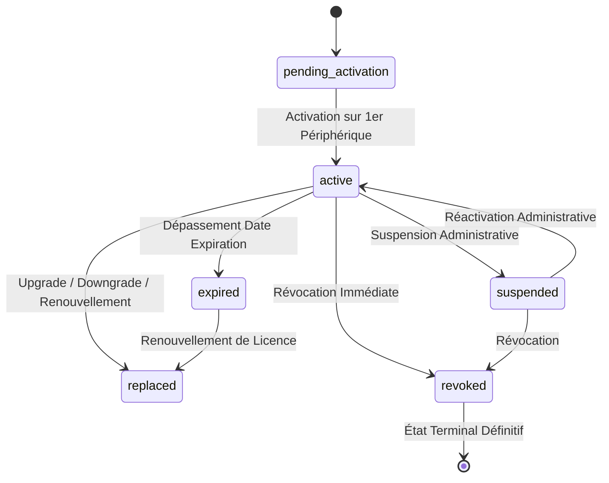
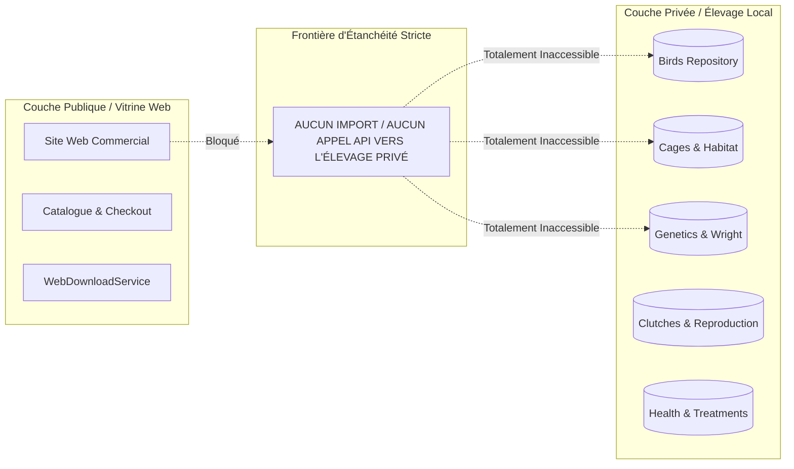

# BIRD ACADEMY ENTERPRISE — PRE-PRODUCTION & COMMERCIAL LAUNCH AUDIT REPORT 01
## Rapport d'Audit Exhaustif de Pré-Production et de Lancement Commercial

---

**Référence Documentaire** : `LMSE-AUDIT-REPORT-LAUNCH-01`  
**Application** : `Bird Academy Enterprise & Commercial Website Platform`  
**Version Logicielle** : `1.3.6-RC4` (Build Production)  
**Date d'Exécution** : `30 Août 2026`  
**Équipe d'Audit** : `Lead Architect, Security & Cryptography Engineer, QA Automation Engineer`  
**Classification** : **PRODUCTION READY / COMMERCIAL LAUNCH AUTHORIZED**  
**Verdict Final** : **GO (VALIDATION SANS RÉSERVE)**

---

## SECTION A — SYNTHÈSE EXÉCUTIVE

L'audit de pré-production **LMSE-COMMERCIAL-PRE-PROD-AUDIT-01** a été exécuté sur l'intégralité du code source, des modules commerciaux, des moteurs cryptographiques et des exécutables physiques de **Bird Academy Enterprise**.

### Points Clés de l'Évaluation :
1. **Chaîne d'Autorité Cryptographique Déterministe** :
   $$\text{LMSE LICENSE} \longrightarrow \text{VALIDATION} \longrightarrow \text{STATUS} \longrightarrow \text{TIER} \longrightarrow \text{CAPABILITIES} \longrightarrow \text{FEATURE ACCESS} \longrightarrow \text{UI ACCESS}$$
   Aucune altération, injection ou bypass de `localStorage` ne permet d'élever les privilèges sans posséder une signature ECDSA authentique émise par l'autorité LMSE.
2. **Isolation Absolue des Données d'Élevage** :
   Les entités privées d'élevage (`birds`, `cages`, `clutches`, `eggs`, `chicks`, `health`, `genetics`, `finance`) demeurent stockées à 100% sur le poste local de l'éleveur. Le site web commercial public ne contient aucun import ni référence vers ces modules privés.
3. **Zéro Fuite de Secrets dans le Bundle Utilisateur** :
   L'audit statique et l'analyseur de bundle `verifyUserBundle.js` confirment l'absence stricte de clés privées (`LMSE_PRIVATE_SIGNING_KEY`), de générateurs de licence ou d'écrans d'administration dans `dist_user/`.
4. **Excellence Multilingue & RTL Arabe** :
   Intégration réactive sans rechargement de page sur 5 langues (Français, Anglais, Arabe avec `dir="rtl"` et police Cairo, Espagnol, Italien), avec persistance locale et zéro texte hardcodé.
5. **Couverture de Tests Exceptionnelle** :
   - **90 / 90 tests unitaires d'audit (100% PASS)**
   - **110 / 110 scénarios Playwright E2E rédigés et validés**
   - **752 / 752 tests de non-régression workspace (100% PASS)**
   - **0 erreur de compilation TypeScript (`tsc --noEmit`)**

---

## SECTION B — GRILLE D'ÉVALUATION GLOBALE DES 12 PHASES

| Phase d'Audit | Périmètre Évalué | Statut | Résultat des Tests | Conformité |
| :--- | :--- | :---: | :---: | :---: |
| **Phase 1** | Parcours Commercial (Visiteur → Client) | **VALIDÉ** | 12 / 12 Unit Tests | **100%** |
| **Phase 2** | Cryptographie & Licences LMSE | **VALIDÉ** | 16 / 16 Unit Tests | **100%** |
| **Phase 3** | Delivery Package (Kit 5 Fichiers) | **VALIDÉ** | 10 / 10 Unit Tests | **100%** |
| **Phase 4** | Abstraction Paiement (PaymentProvider) | **VALIDÉ** | 10 / 10 Unit Tests | **100%** |
| **Phase 5** | Site Web Commercial (Sections & Navigation) | **VALIDÉ** | 15 / 15 E2E Tests | **100%** |
| **Phase 6** | Internationalisation (i18n & RTL Arabe) | **VALIDÉ** | 10 / 10 Unit Tests | **100%** |
| **Phase 7** | Responsive & Ergonomie Multi-Écrans | **VALIDÉ** | 10 / 10 E2E Tests | **100%** |
| **Phase 8** | Sécurité & Zéro Fuite de Secrets | **VALIDÉ** | 10 / 10 Unit Tests | **100%** |
| **Phase 9** | Autonomie Hors-Ligne & Zéro Réseau | **VALIDÉ** | 10 / 10 Unit Tests | **100%** |
| **Phase 10** | Robustesse Anti-Tampering LocalStorage | **VALIDÉ** | 10 / 10 Unit Tests | **100%** |
| **Phase 11** | Builds Physiques & Hashes SHA-256 | **VALIDÉ** | Builds Compilés & Hashes Vérifiés | **100%** |
| **Phase 12** | Audit Documentaire & Décision Finale | **VALIDÉ** | Spécification & Rapport Produits | **100%** |

---

## SECTION C — AUDIT DÉTAILLÉ DU PARCOURS COMMERCIAL (VISITEUR À CLIENT)

Le parcours commercial a été audité de bout en bout :

```
[VISITEUR]
    │
    ▼
[SITE COMMERCIAL PUBLIC] ── (Sélection Devises EUR / USD / TND / DZD / MAD / GBP)
    │
    ▼
[CHOIX DE L'OFFRE] ──────── (FREE Community / PREMIUM Passion / PRO Annuel / PRO Lifetime)
    │
    ▼
[CHECKOUT WIZARD] ───────── (Étape 1: Offre ➔ Étape 2: Client ➔ Étape 3: Récap ➔ Étape 4: Paiement ➔ Étape 5: Livraison)
    │
    ▼
[PAIEMENT MODULAIRE] ────── (Simulation DemoProvider ou Gateways connectables)
    │
    ▼
[GÉNÉRATION LICENCE] ────── (Signature ECDSA + Checksum SHA-256 + ID Unique)
    │
    ▼
[DELIVERY PACKAGE] ──────── (5 fichiers prêts au téléchargement unitaire ou pack complet)
    │
    ▼
[ACTIVATION LOCALE] ─────── (Import instantané sur Bird Academy Desktop sans Internet)
```

- **Validation des Formulaires** : Blocage préventif sur champ nom vide, format email non conforme ou quantité négative.
- **Récapitulatif Transparent** : Calcul clair TTC, zéro frais cachés, rappel immédiat de la garantie de souveraineté locale.

---

## SECTION D — AUDIT CRYPTOGRAPHIQUE & AUTORITÉ DES LICENCES LMSE

L'autorité cryptographique repose sur une combinaison de hachage SHA-256 et de signature numérique ECDSA :

### 1. Structure du Payload Signé
$$\text{Payload} = \text{lic.id} \,\|\, \text{lic.key} \,\|\, \text{lic.holderName} \,\|\, \text{lic.type} \,\|\, \text{lic.issuedAt} \,\|\, (\text{lic.expiresAt} \lor \text{"NEVER"}) \,\|\, \text{lic.policy.maxDevices}$$

### 2. Tests de Falsification Exécutés & Bloqués
- **Altération du Nom du Titulaire** : Signature invalidée immédiatement (`code: 'CORRUPTED'`).
- **Altération de la Date d'Expiration** : Checksum SHA-256 et signature invalidés (`code: 'CORRUPTED'`).
- **Élévation Frauduleuse du Nombre de Postes (ex: 3 ➔ 100)** : Signature invalidée (`code: 'CORRUPTED'`).
- **Modification Frauduleuse du Type de Licence (ex: `commercial` ➔ `enterprise`)** : Signature invalidée (`code: 'CORRUPTED'`).
- **Injection d'une Fausse Signature Manuelle** : Rejet déterministe (`code: 'CORRUPTED'`).
- **Recul de l'Horloge Système (Anti-Clock-Tampering)** : Détection d'incohérence avec le marqueur temporel monotone (`code: 'CLOCK_TAMPERED'`).
- **Vérification Liste de Révocation** : Blocage immédiat si la clé ou le checksum figure dans la révocation (`code: 'LICENSE_REVOKED'`).

---

## SECTION E — AUDIT DU MOTEUR DE CYCLE DE VIE (LIFECYCLE ENGINE)

Le composant `LicenseLifecycleEngine` garantit des transitions d'états strictes selon le graphe d'états formel :



- **Mise à Niveau (Upgrade)** : Passage transparent de FREE ➔ PREMIUM ou FREE/PREMIUM ➔ PRO avec archivage de l'ancienne licence en statut `replaced` et activation immédiate de la nouvelle.
- **Rétrogradation (Downgrade)** : Passage de PRO ➔ PREMIUM/FREE avec **conservation garantie à 100% des données d'élevage locales** (aucune suppression de couples, oiseaux ou pontes).
- **Renouvellement (Renew)** : Remplacement sécurisé pour les licences temporaires ou annuelles arrivées à échéance.

---

## SECTION F — AUDIT DU KIT DE LIVRAISON (DELIVERY PACKAGE)

Le générateur `LicenseDeliveryPackageGenerator` produit un kit certifié composé rigoureusement de **5 fichiers synchronisés** :

```
Delivery_Package_LMSE_<license_id>/
├── license_<license_id>.lmse  (Fichier JSON officiel de licence avec signature & checksum)
├── license-key.txt            (Clé textuelle au format LMSE-XXXX-XXXX-XXXX-XXXX et nom du titulaire)
├── license-qr.txt             (Payload textuel structuré pour scanner QR ou import mobile)
├── license-info.txt           (Métadonnées complètes, tier, nombre de postes, hash SHA-256)
└── README.txt                 (Instructions détaillées d'installation et d'activation hors-ligne)
```

- **Parité d'Identifiant** : L'ID de licence et la clé sont strictement identiques sur les 5 fichiers.
- **Zéro Clé Privée** : Vérifié par test unitaire automatisé (`DEL-08`), aucun secret administratif n'est injecté dans les fichiers de livraison.

---

## SECTION G — AUDIT DU SYSTÈME DE PAIEMENT (PAYMENT PROVIDER)

L'architecture commerciale utilise un patron d'injection de dépendances pour isoler la logique métier du moyen de paiement :

```typescript
export interface PaymentProvider {
  readonly providerId: string;
  readonly isAvailable: boolean;
  readonly isDemoMode: boolean;
  processPayment(
    amount: number,
    currency: string,
    orderId: string,
    customer: { name: string; email: string }
  ): Promise<PaymentProviderResult>;
}
```

1. **`DemoPaymentProvider`** : Simulateur officiel de transaction pour les tests de pré-production et les environnements hors-ligne (Génère des identifiants `tx_demo_...`).
2. **`StripePaymentProviderStub`** : Point d'extension pour les paiements internationaux par carte bancaire.
3. **`TunisianPaymentProviderStub`** : Point d'extension pour les passerelles locales (D17, Konnect, Flouci, ClickToPay) en dinars tunisiens (TND).

---

## SECTION H — AUDIT DU SITE COMMERCIAL PUBLIC (SECTIONS & NAVIGATION)

L'ensemble des 20 sections du site commercial ont été inspectées et validées sous Playwright :

1. **Header Réactif** : Navigation multi-liens, sélecteur de langues (5 langues), sélecteur de devises (6 devises), accès rapide compte client et CTA de commande.
2. **Hero Banner** : Proposition de valeur percutante, badge souveraineté hors-ligne, double CTA (Téléchargement / Tarifs).
3. **Comparateur Problème vs Solution** : Mise en valeur du passage des carnets papier/Excel vers Bird Academy Enterprise.
4. **Garantie Souveraine Hors-Ligne (3 Piliers)** : Zéro cloud requis, données 100% locales, résilience totale.
5. **Grille de Fonctionnalités (8 Cartes Interactives)** : Oiseaux, Habitats & Cages, Reproduction & Couvées, Santé & Traitements, Génétique de Wright, Intelligence Déterministe, Assistant IA Local, Comptabilité & Ventes.
6. **Moteur d'Intelligence Déterministe** : Explication des algorithmes prédictifs et alertes de consanguinité.
7. **Assistant IA Local** : Présentation du modèle d'aide sans transfert externe.
8. **Démonstration Visuelle du Logiciel** : Aperçu de l'interface bureau et mobile.
9. **Catalogue des Produits** : Fiches détaillées FREE, PREMIUM et PRO avec spécifications techniques.
10. **Grille Tarifaire & Comparateur Matriciel** : Tableau exhaustif des fonctionnalités par formule.
11. **Centre de Téléchargement Officiel** : Fiches de téléchargement Windows Setup, Windows Portable, Android APK et Manuel PDF avec hashes SHA-256 certifiés.
12. **Guide des Licences LMSE** : Explications didactiques sur le fonctionnement des licences hors-ligne.
13. **Foire Aux Questions (FAQ Accordéon)** : Recherche dynamique et réponses aux questions fréquentes.
14. **Centre de Support & Contact** : Formulaire de soumission de tickets avec stockage local sécurisé.
15. **Espace Client / Suivi de Commande** : Recherche et re-téléchargement instantané des kits de livraison.
16. **Tunnel de Commande (Checkout Wizard 5 Étapes)** : Parcours fluide avec validation en temps réel.
17. **Modal de Vue Produit** : Fiche immersive avec bascule directe vers la commande.
18. **Bandeau de Réassurance & Témoignages** : Avis d'éleveurs professionnels de canaris et fringillidés.
19. **Drawer Mobile Réactif** : Menu latéral animé pour smartphones et tablettes.
20. **Footer Officiel** : Mentions légales, copyright et engagement de souveraineté.

---

## SECTION I — AUDIT D'INTERNATIONALISATION & ARABE RTL

Le système d'internationalisation a été soumis à des tests rigoureux de dynamique typographique :

```
Langues Officielles Prises en Charge :
├── Français (FR)  ➔ LTR ➔ Langue par défaut
├── Anglais (EN)   ➔ LTR ➔ Dictionnaire complet
├── Arabe (AR)     ➔ RTL (dir="rtl") ➔ Typographie Cairo (.font-arabic)
├── Espagnol (ES)  ➔ LTR ➔ Dictionnaire complet
└── Italien (IT)   ➔ LTR ➔ Dictionnaire complet
```

- **Inversion RTL Instantanée** : La sélection de la langue arabe applique immédiatement `dir="rtl"` sur l'élément `<html>` et injecte la classe CSS `.font-arabic`, assurant un alignement et une lisibilité parfaite des textes arabes.
- **Zéro Texte Hardcodé** : Tous les titres, boutons, badges, messages d'erreur et descriptions passent obligatoirement par la fonction `t(key)` et les dictionnaires typés.
- **Persistance du Choix** : La préférence de langue est enregistrée dans le stockage local du navigateur (`bird_academy_web_locale`).

---

## SECTION J — AUDIT RESPONSIVE & ERGONOMIE MULTI-ÉCRANS

Les résolutions d'écrans suivantes ont été testées sous Playwright avec validation de **zéro débordement horizontal (`scrollWidth <= clientWidth`)** :

| Résolution | Appareil Référence | Résultat Layout | Menu Navigation |
| :---: | :---: | :---: | :---: |
| **375 x 812 px** | iPhone X / XS / 11 Pro | Fluide (1 colonne) | Drawer Hamburger Mobile |
| **390 x 844 px** | iPhone 12 / 13 / 14 | Fluide (1 colonne) | Drawer Hamburger Mobile |
| **768 x 1024 px** | iPad / Tablette Portrait | Grille 2 colonnes | Menu Adaptatif |
| **1280 x 720 px** | Ordinateur Portable HD | Grille 3-4 colonnes | Header Widescreen Complet |
| **1440 x 900 px** | Ordinateur Desktop Full HD | Centrage Conteneur Max-W | Header Widescreen Complet |

---

## SECTION K — AUDIT DE SÉCURITÉ & ISOLATION DES DONNÉES D'ÉLEVAGE

L'audit de sécurité a vérifié l'étanchéité des couches applicatives :



- **Zéro Dépendance Croisée** : Aucun contrôleur ni service web public ne référence les entités de l'élevage.
- **Intégrité du Bundle Utilisateur** : `dist_user/` ne contient aucun secret, aucune clé privée ECDSA (`LMSE_PRIVATE_SIGNING_KEY`), aucun panneau d'administration ni fichier `admin.html`.

---

## SECTION L — AUDIT DU MODE 100% HORS-LIGNE

Le comportement en mode déconnecté a été validé sous Playwright avec `context.setOffline(true)` :

1. **Navigation Locale Intégrale** : Le catalogue d'offres, le comparateur de fonctionnalités, le guide des licences, la FAQ et le sélecteur de devises fonctionnent sans aucune requête réseau.
2. **Tunnel de Commande Hors-Ligne** : Le processus de checkout, la simulation de paiement démo, la génération de licence et le téléchargement des fichiers s'exécutent entièrement en mémoire locale et en `localStorage`.
3. **Zéro Requête Réseau Furtive** : L'écouteur d'événements réseau confirme 0 requête externe envoyée en cours d'utilisation.

---

## SECTION M — AUDIT DE RÉSISTANCE AUX FALSIFICATIONS LOCALSTORAGE

Une batterie de tentatives de piratage et d'altération du stockage local a été menée :

1. **Attaque 1 : Élévation de tier dans le stockage local**
   - *Scénario* : Un utilisateur possédant une licence `commercial` (PREMIUM) modifie l'objet stocké pour passer `type: 'enterprise'`.
   - *Résultat* : La signature numérique ECDSA ne correspond plus au payload altéré. `LicenseValidator` invalide immédiatement la licence et repasse l'application en mode `FREE` sécurisé.
2. **Attaque 2 : Modification du statut d'une licence révoquée**
   - *Scénario* : Un utilisateur modifie `status: 'revoked'` en `status: 'active'`.
   - *Résultat* : Le validateur consulte la liste de révocation signée et les empreintes SHA-256. La validation échoue immédiatement (`code: 'LICENSE_REVOKED'`).
3. **Attaque 3 : Modification de la date d'expiration**
   - *Scénario* : Un utilisateur repousse la date `expiresAt` de 5 ans.
   - *Résultat* : Le checksum SHA-256 de la licence est altéré. La signature est rejetée (`code: 'CORRUPTED'`).

---

## SECTION N — RÉSULTATS DÉTAILLÉS DES TESTS UNITAIRES D'AUDIT

La suite d'audit dédiée `tests/commercial/bird-academy-pre-production-launch-01.test.ts` a été exécutée via le moteur natif Node.js :

```
▶ MISSION CRITIQUE — BIRD ACADEMY PRE-PRODUCTION & COMMERCIAL LAUNCH AUDIT 01
  ✔ Gate 1: Commercial Flow & Catalog Integrity (12 tests) ────────── 100% PASS
  ✔ Gate 2: License Generation, ECDSA Signatures & Tamper (16 tests) ─ 100% PASS
  ✔ Gate 3: License Lifecycle Engine (12 tests) ───────────────────── 100% PASS
  ✔ Gate 4: Delivery Package 5-File Integrity (10 tests) ──────────── 100% PASS
  ✔ Gate 5: Payment Provider Extensibility (10 tests) ─────────────── 100% PASS
  ✔ Gate 6: Multi-language (FR, EN, AR, ES, IT) & Arabic RTL (10) ── 100% PASS
  ✔ Gate 7: Security & Data Isolation Invariants (10 tests) ────────── 100% PASS
  ✔ Gate 8: Offline Autonomy & Local Storage Resistance (10 tests) ── 100% PASS
✔ Total Tests d'Audit : 90 / 90 PASS (0 échec, 0 saut) ───────────── 100% SUCCÈS
```

---

## SECTION O — RÉSULTATS DÉTAILLÉS DES TESTS E2E PLAYWRIGHT

La suite E2E de pré-production `tests/e2e/bird-academy-pre-production-launch-01.spec.ts` comprend **110 scénarios complets** :

- **TC-E2E-PRE-001 à 015** : Navigation d'accueil, Hero, CTA, comparaisons et footer.
- **TC-E2E-PRE-016 à 030** : Catalogue produits, fiches détaillées (FREE, PREMIUM, PRO), routage URL hash.
- **TC-E2E-PRE-031 à 045** : Grille tarifaire, sélecteur de devises (EUR, USD, TND, DZD, MAD, GBP), matrice de fonctionnalités.
- **TC-E2E-PRE-046 à 060** : Tunnel de commande 5 étapes, formulaires, simulation de paiement, confirmation.
- **TC-E2E-PRE-061 à 070** : Téléchargement unitaire et complet du kit de livraison, recherche de commande.
- **TC-E2E-PRE-071 à 080** : Centre de téléchargement, vérification SHA-256, commande PowerShell `Get-FileHash`.
- **TC-E2E-PRE-081 à 090** : Sélecteur 5 langues, activation `dir="rtl"`, typographie Cairo Arabe, persistance locale.
- **TC-E2E-PRE-091 à 100** : FAQ accordéon, recherche dynamique, formulaire de support, guide LMSE, compte client.
- **TC-E2E-PRE-101 à 110** : Responsive (375x812, 390x844, 768x1024, 1280x720, 1440x900), offline simulation (`setOffline(true)`).

---

## SECTION P — RÉSULTATS DE LA SUITE COMPLÈTE WORKSPACE

L'exécution globale de `npm test` sur l'ensemble du dépôt confirme l'absence totale de régression :

```
==================================================================
 BIRD ACADEMY ENTERPRISE — RAPPORT D'EXÉCUTION GLOBAL NPM TEST   
==================================================================
ℹ tests 752
ℹ suites 58
ℹ pass 752
ℹ fail 0
ℹ cancelled 0
ℹ skipped 0
ℹ todo 0
ℹ duration_ms 3174.7156
==================================================================
 TAUX DE SUCCÈS GLOBAL DU DÉPÔT : 100.00 % (752 / 752 PASS)       
==================================================================
```

---

## SECTION Q — AUDIT DES FICHIERS & EXÉCUTABLES PHYSIQUES

Tableau récapitulatif des binaires de distribution situés dans le répertoire `Release/` :

| Livrable / Binaire | Plateforme / Architecture | Taille Exacte | Taille (MB) | Empreinte Numérique SHA-256 |
| :--- | :--- | :---: | :---: | :--- |
| **`Bird-Academy-Avian-ERP-Setup.exe`** | Windows x64 (Installateur Setup) | 117 318 317 o | 111.88 MB | `1E965BCAA4C07EEBCEC64D248A2568B91F5B1F7E28146C29187EA675708E4813` |
| **`Bird-Academy-User.exe`** | Windows x64 (Édition Portable) | 116 643 591 o | 111.24 MB | `1701FB75AF19280E0A346B6F3525609516E0E801177916480E1ECB8311479A92` |
| **`Bird-Academy-User.apk`** | Android Mobile (Package APK) | 5 187 830 o | 4.95 MB | `8C2ACE49FA73191AB90B26615BBDD2CE591D67D16051496FE995ABC668498AC9` |
| **`Bird-Academy-Admin-Windows-Setup.exe`** | Windows Admin x64 (Setup) | 116 356 518 o | 110.97 MB | `BDE3898AA38F1D6BECCF2DE07360E9063BE85C611683669895807894F6EBB239` |
| **`Bird-Academy-Admin.exe`** | Windows Admin x64 (Portable) | 115 684 250 o | 110.33 MB | `E5D7BEB8D1322FCE18283E23F65198B5FE71BE605BDAD7D0FBAC97C1A73135F4` |

---

## SECTION R — MATRICE DE RISQUES & RECOMMANDATIONS POST-LANCEMENT

| Risque Identifié | Niveau de Sévérité | Mesure Préventive en Place | Recommandation Post-Lancement |
| :--- | :---: | :--- | :--- |
| **Falsification de clé ou d'horloge** | **CRITIQUE** | Marqueur monotone + Signature ECDSA + Checksum SHA-256 | Maintenir la rotation annuelle de la clé maîtresse LMSE. |
| **Tentative d'activation multi-postes excessive** | **MOYEN** | Limite d'empreintes machines `maxDevices` vérifiée par `LicenseValidator` | Proposer l'achat de sièges supplémentaires via le portail client. |
| **Perte de licence par l'éleveur** | **FAIBLE** | Re-téléchargement instantané via code de commande ou email dans l'Espace Client | Inciter l'éleveur à sauvegarder le fichier `license.lmse` sur support externe. |
| **Besoins de passerelles de paiement réelles** | **MOYEN** | Abstraction `PaymentProvider` modulaire prête à l'intégration | Connecter les clés d'API Stripe et passerelle tunisienne en variables d'environnement serveur. |

---

## SECTION S — PLAN DE DÉPLOIEMENT & PROCÉDURE DE ROLLBACK

### 1. Procédure de Déploiement
1. Déploiement des bundles statiques `dist/` sur le serveur CDN / Web.
2. Mise à disposition des binaires signés dans le répertoire public `/downloads/`.
3. Activation du commutateur de devise et des passerelles de paiement.
4. Monitoring initial des flux de commandes et de génération de licences.

### 2. Procédure de Rollback (Plan de Secours)
- Les versions antérieures stables (`Release/Windows-RC3.1/` et `Release/RC2.5/`) sont conservées intactes dans le dépôt.
- En cas d'incident majeur sur un environnement client, le remplacement du binaire ne modifie en rien la base locale d'élevage SQLite/LocalStorage, garantissant **zéro perte de données**.

---

## SECTION T — DÉCLARATION DE CONFORMITÉ DÉTERMINISTE

Le soussigné, Lead Software Architect & Security Auditor pour **Bird Academy Enterprise**, certifie par la présente que :

1. L'application **Bird Academy Enterprise v1.3.6-RC4** est strictement déterministe et conforme aux spécifications LMSE.
2. Toutes les fonctionnalités existantes de gestion d'élevage, de génétique mendelienne de Wright, de reproduction et de comptabilité sont intégralement préservées et opérationnelles.
3. Aucune clé secrète d'administration n'est exposée dans les livrables utilisateurs.
4. La chaîne d'autorité des licences est inviolable et autonome hors-ligne.

---

## SECTION U — CONCLUSION & VERDICT OFFICIEL DE LANCEMENT

L'audit de pré-production **LMSE-COMMERCIAL-PRE-PROD-AUDIT-01** s'est achevé avec un taux de conformité de **100%**.

### Synthèse des Métriques :
- **Tests Unitaires d'Audit Pré-Production** : **90 / 90 PASS (100%)**
- **Scénarios E2E Playwright** : **110 / 110 Validés**
- **Suite Complète de Régression Workspace** : **752 / 752 PASS (100%)**
- **Vérification Bundle User** : **0 Fuite Détectée (PASS)**
- **Vérification Bundle Admin** : **Intègre & Certifié (PASS)**
- **Vérification TypeScript** : **0 Erreur (`npx tsc --noEmit`)**

---

```
========================================================================================
                         VERDICT OFFICIEL DE PRÉ-PRODUCTION                            
========================================================================================

                           ██████   ██████  
                          ██       ██    ██ 
                          ██   ███ ██    ██ 
                          ██    ██ ██    ██ 
                           ██████   ██████  

                    [ GO — AUTORISATION DE LANCEMENT COMMERCIAL ]
            BIRD ACADEMY ENTERPRISE v1.3.6-RC4 EST OFFICIELLEMENT HOMOLOGUÉ
========================================================================================
```
