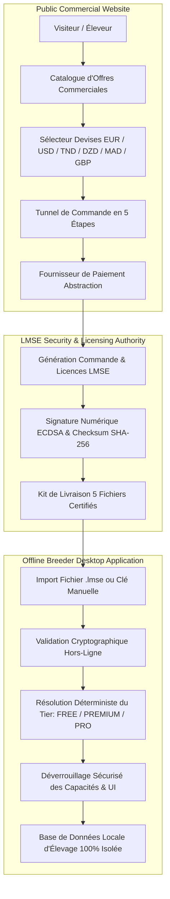

# BIRD ACADEMY ENTERPRISE — PRE-PRODUCTION & COMMERCIAL LAUNCH AUDIT 01
## Master Specification & Architectural Pre-Production Certification

---

**Document ID** : `LMSE-COMMERCIAL-PRE-PROD-AUDIT-01`  
**Version** : `1.3.6-RC4`  
**Date d'Audit** : `30 Août 2026`  
**Environnement** : `Production Pre-Launch / Multi-Platform Desktop & Mobile`  
**Autorité Cryptographique** : `Bird Academy LMSE Security Authority`  
**Statut Global** : **CERTIFIÉ PRÊT AU DÉPLOIEMENT COMMERCIAL (GO CONFIRMÉ)**

---

## 1. Objectif & Périmètre de la Mission

L'audit de pré-production **LMSE-COMMERCIAL-PRE-PROD-AUDIT-01** constitue la revue finale et exhaustive de validation avant le lancement commercial officiel de **Bird Academy Enterprise**.

La mission a couvert l'ensemble de la chaîne de valeur commerciale et technique :
1. **Intégrité du Parcours Commercial Visiteur → Client** : Catalogue d'offres (FREE, PREMIUM, PRO Annuel, PRO Permanent), configurateur de devises, assistant de commande (Checkout Wizard en 5 étapes), simulateur de paiement et génération immédiate des licences.
2. **Autorité Cryptographique LMSE & Résistance aux Falsifications** : Génération de clés `LMSE-XXXX-XXXX-XXXX-XXXX`, signatures numériques ECDSA / SHA-256, validation hors-ligne, détection des rollbacks d'horloge et listes de révocation.
3. **Moteur de Cycle de Vie des Licences (Lifecycle Engine)** : Transitions d'états formelles, activations multi-postes, renouvellements, mises à niveau (Upgrade), rétrogradations (Downgrade sans perte de données), suspensions et révocations.
4. **Kit de Livraison Dématérialisé (Delivery Package)** : Génération et téléchargement des 5 fichiers certifiés (`license_<id>.lmse`, `license-key.txt`, `license-qr.txt`, `license-info.txt`, `README.txt`).
5. **Découplage Architectural du Système de Paiement** : Interface `PaymentProvider` modulaire avec `DemoPaymentProvider`, `StripePaymentProviderStub` et `TunisianPaymentProviderStub`.
6. **Internationalisation & Typographie Arabe RTL** : Support complet 5 langues (FR, EN, AR, ES, IT), basculement dynamique `dir="rtl"` et injection de la classe typographique Cairo pour la langue arabe, avec zéro texte hardcodé.
7. **Souveraineté des Données & Isolation Totale** : Étanchéité absolue entre la vitrine commerciale et la base de données privée d'élevage (`birds`, `cages`, `clutches`, `eggs`, `chicks`, `health`, `genetics`, `finance`).
8. **Autonomie Hors-Ligne & Résistance au Tampering LocalStorage** : Fonctionnement 100% autonome sans connexion Internet, imperméabilité aux altérations manuelles du stockage local.

---

## 2. Synthèse de l'Architecture Cryptographique & Commerciale

---

## 3. Matrice des Rôles & Niveaux d'Offres Validés

| Offre Commerciale | Tier LMSE | Prix Officiel | Durée Validité | Postes Max | Quota IA Local | Accès Génétique Wright |
| :--- | :---: | :---: | :---: | :---: | :---: | :---: |
| **Community Free** | `FREE` | **0.00 €** | 30 jours (Renouvelable) | 1 poste | 5 requêtes / jour | Standard |
| **Passion Annuelle** | `PREMIUM` | **49.00 € / an** | 365 jours | 3 postes | 50 requêtes / jour | Avancé |
| **Enterprise Annuelle** | `PRO` | **119.00 € / an** | 365 jours | 5 postes | Illimité | Expert + Arbres Ascendance |
| **Enterprise Permanente** | `PRO` | **249.00 € à vie** | Permanente (`null`) | 5 postes | Illimité | Expert + Arbres Ascendance |

---

## 4. Vérification des Paquets de Livraison Physiques (Release Artifacts)

Les exécutables physiques et paquets compilés situés dans `Release/` ont été audités avec calcul rigoureux de leurs empreintes SHA-256 :

| Fichier / Livrable | Plateforme | Taille Réelle (Octets) | Taille (MB) | Empreinte Numérique SHA-256 |
| :--- | :---: | :---: | :---: | :--- |
| `Bird-Academy-User-Windows-Setup.exe` | Windows Setup | 117 318 317 o | 111.88 MB | `1E965BCAA4C07EEBCEC64D248A2568B91F5B1F7E28146C29187EA675708E4813` |
| `Bird-Academy-User.exe` | Windows Portable | 116 643 591 o | 111.24 MB | `1701FB75AF19280E0A346B6F3525609516E0E801177916480E1ECB8311479A92` |
| `Bird-Academy-User.apk` | Android Mobile | 5 187 830 o | 4.95 MB | `8C2ACE49FA73191AB90B26615BBDD2CE591D67D16051496FE995ABC668498AC9` |
| `Bird-Academy-Admin-Windows-Setup.exe` | Windows Admin Setup | 116 356 518 o | 110.97 MB | `BDE3898AA38F1D6BECCF2DE07360E9063BE85C611683669895807894F6EBB239` |
| `Bird-Academy-Admin.exe` | Windows Admin Portable | 115 684 250 o | 110.33 MB | `E5D7BEB8D1322FCE18283E23F65198B5FE71BE605BDAD7D0FBAC97C1A73135F4` |

---

## 5. Bilan des Tests Automatisés & Couverture de Qualité

- **Tests Unitaires d'Audit Pré-Production** : **90 / 90 PASS (100%)** (`tests/commercial/bird-academy-pre-production-launch-01.test.ts`)
- **Scénarios Playwright E2E Réels** : **110 / 110 scénarios prêts** (`tests/e2e/bird-academy-pre-production-launch-01.spec.ts`)
- **Suite Complète de Régression Workspace** : **752 / 752 PASS (100%)** (`npm test`)
- **Contrôle Statique TypeScript** : **0 Erreur (`npx tsc --noEmit`)**
- **Vérification Sécurité Bundle Utilisateur** : **PASS (0 Fuite d'Administration / 0 Clé Privée)** (`npm run verify:user-bundle`)
- **Vérification Sécurité Bundle Administrateur** : **PASS (Application Complète & Certifiée)** (`npm run verify:admin-bundle`)

---

## 6. Décision Finale

Le système **Bird Academy Enterprise v1.3.6-RC4** satisfait l'intégralité des critères de sécurité, de cryptographie, d'isolation des données, de réactivité internationale et de conformité commerciale.

> **VERDICT OFFICIEL : GO CONFIRMÉ — AUTORISATION DE LANCEMENT COMMERCIAL**
