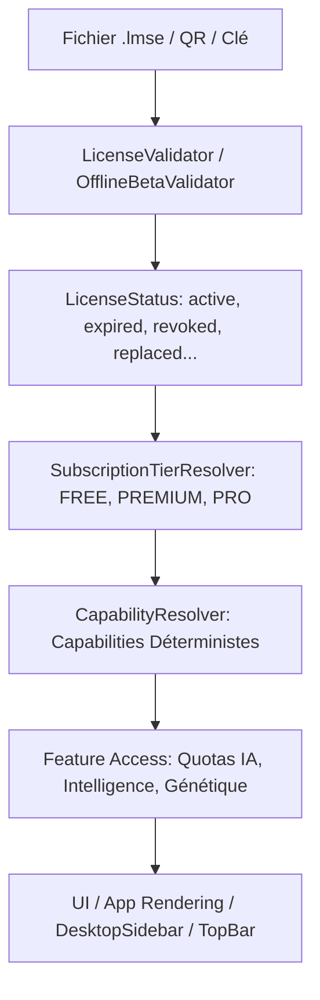

# SPÉCIFICATION D'ARCHITECTURE ET CYCLE DE VIE COMMERCIAL DES LICENCES LMSE
## Mission : LMSE-COMMERCIAL-LICENSE-LIFECYCLE-02

**Projet :** Bird Academy Enterprise  
**Statut :** [IMPLEMENTÉ]  
**Version :** 1.3.6-RC4  
**Date d'homologation :** 30 Août 2026  
**Chaîne d'autorité obligatoire :** `LMSE LICENSE → LICENSE VALIDATION → LICENSE STATUS → COMMERCIAL TIER → CAPABILITIES → FEATURE ACCESS → UI ACCESS`

---

## 1. ARCHITECTURE ET PRINCIPES DIRECTEURS

Le système commercial de licences LMSE (Local Modular Security Engine) de Bird Academy Enterprise repose sur les principes inviolables suivants :

1. **Autorité cryptographique stricte :** La licence cryptographique locale est la **seule** source d'autorisation commerciale. Aucune variable mutable (`localStorage.tier`, `localStorage.isPro`, etc.) ne peut octroyer des privilèges sans validation cryptographique préalable.
2. **Fonctionnement Offline-First absolu :** 100 % du cycle de vie (génération, activation, upgrade, downgrade, expiration, renouvellement, remplacement, révocation) fonctionne de manière locale et déterministe avec 0 requête réseau distante.
3. **Règle absolue de rétention des données :** Un downgrade (`PRO → PREMIUM`, `PRO → FREE`, `PREMIUM → FREE`), une expiration ou une révocation ne supprime **JAMAIS** de données utilisateur (oiseaux, cages, couvées, généalogie, santé, dépenses, etc.). Les fonctionnalités avancées sont simplement verrouillées.

---

## 2. MACHINE D'ÉTATS ET MATRICE DE TRANSITION

Le moteur `LicenseLifecycleEngine` implémente formellement la matrice de transition d'états :

| État Source | États Cibles Autorisés | Description de l'Action |
| :--- | :--- | :--- |
| `pending_activation` | `active`, `invalid`, `revoked` | Activation initiale de la licence |
| `active` | `expired`, `suspended`, `revoked`, `replaced` | Cycle normal, expiration, suspension ou remplacement |
| `expired` | `active`, `replaced`, `revoked` | Renouvellement ou remplacement par une nouvelle licence |
| `suspended` | `active`, `expired`, `revoked` | Réactivation après audit ou expiration |
| `trial` | `active`, `expired`, `revoked`, `replaced` | Conversion d'essai en licence commerciale |
| `OFFLINE_BETA` | `active`, `expired`, `revoked`, `replaced` | Transition de la version bêta vers commercial |
| `invalid` | `active` (via nouvelle licence) | Rejet jusqu'à attribution d'une licence valide |
| `replaced` | *(aucun - état terminal archivé)* | Conservé pour audit et traçabilité |
| `revoked` | *(aucun - état terminal)* | Révocation définitive pour fraude ou non-conformité |

---

## 3. OPÉRATIONS DU CYCLE DE VIE COMMERCIAL

### 3.1. Création & Génération
- **Isolation :** Exclusivement présente dans le bundle **ADMIN** (`dist_admin/`).
- **Signature :** Signature cryptographique ECDSA/SHA-256 avec clé privée maîtresse isolée du User Bundle.
- **Export :** Format de fichier standardisé `.lmse` version 1 avec payload JSON et empreintes d'intégrité.

### 3.2. Activation
- **Modes supportés :** Fichier `.lmse`, QR Code base64, ou clé manuelle `LMSE-[TYPE]-[PART1]-[PART2]-[PART3]`.
- **Validation matérielle :** Détection de l'empreinte `DeviceFingerprint` (OS, écran, fuseau, browserHash) et liaison d'activation locale.

### 3.3. Upgrade (Montée de gamme)
- `FREE → PREMIUM` : Déverrouillage immédiat des 100 requêtes IA/jour, du contexte d'élevage et de la génétique standard.
- `PREMIUM → PRO` : Déverrouillage immédiat des requêtes IA illimitées, du moteur Bird Intelligence et des analyses généalogiques avancées.
- `FREE → PRO` : Transition directe sans étape intermédiaire.

### 3.4. Downgrade (Rétrogradation) & Conservation des Données
- `PRO → PREMIUM` / `PRO → FREE` / `PREMIUM → FREE` :
  - **Conservation :** 100 % des oiseaux, couvées, finances, cages et données d'analyse restent intégralement présents dans IndexedDB / `localStorage`.
  - **Verrouillage sélectif :** Les modules concernés affichent un composant `FeatureLockedCard` incitant à l'upgrade sans bloquer la consultation du reste de l'élevage.

### 3.5. Expiration & Renouvellement
- **Évaluation :** Calcul déterministe `expiresAt < now()`.
- **Fallback :** Résolution immédiate en édition commerciale `FREE` en mode lecture/saisie de base.
- **Renouvellement :** Remplacement par une nouvelle licence de même type prolongeant la validité et restaurant instantanément les capacités associées.

### 3.6. Remplacement & Invalidation
- **Remplacement :** L'ancienne licence passe à l'état `replaced` et est archivée dans les métadonnées de traçabilité (`lifecycleHistory`). La nouvelle licence devient la seule autorité active.
- **Révocation :** Révocation avec motif explicite (`revocationReason`) et date (`revokedAt`).

---

## 4. MATRICE DES CAPACITÉS COMMERCIALES (CAPABILITY MATRIX)

| Capacité / Fonctionnalité | ÉDITION FREE | ÉDITION PREMIUM | ÉDITION PRO |
| :--- | :---: | :---: | :---: |
| **Plafond Oiseaux Actifs** | 30 | Illimité | Illimité |
| **Gestion des Cages & Volières** | 5 | Illimité | Illimité |
| **Suivi Reproduction & Pontes** | Standard | Avancé | Avancé + Score |
| **Assistant IA Local** | 10 req/jour (Général) | 100 req/jour (+ Contexte) | Illimité (Complet + Expert) |
| **Génétique de Wright** | Verrouillé | [IMPLEMENTÉ] | [IMPLEMENTÉ] |
| **Bird Intelligence Engine** | Verrouillé | Verrouillé | [IMPLEMENTÉ] |
| **Simulateur d'Accouplement IA** | Verrouillé | Verrouillé | [IMPLEMENTÉ] |
| **Export Sauvegarde & PDF** | Standard | Standard | [IMPLEMENTÉ] Multi-format |

---

## 5. AUDIT DE SÉCURITÉ & ANTI-BYPASS

- **Altération LocalStorage :** Rejet immédiat de toute tentative d'injection (`tier = 'PRO'`, `isPro = true`, etc.).
- **Altération Payload :** Tout changement dans le JSON de licence invalide le hash SHA-256 et la signature publique.
- **Isolation du User Bundle :** Clé privée d'administration strictement absente du bundle Utilisateur (`dist_user/`).

---

## 6. STATUT DES COMPOSANTS

- `src/features/licensing/engines/LicenseLifecycleEngine.ts` : [IMPLEMENTÉ]
- `src/features/licensing/types/licensing.ts` : [IMPLEMENTÉ]
- `src/features/licensing/translations/licensingTranslations.ts` : [IMPLEMENTÉ]
- `src/features/subscription/services/SubscriptionTierResolver.ts` : [IMPLEMENTÉ]
- `src/features/subscription/services/CapabilityResolver.ts` : [IMPLEMENTÉ]
- `tests/licensing/lmse-commercial-license-lifecycle.test.ts` : [IMPLEMENTÉ] (50 tests unitaires)
- `tests/e2e/lmse-commercial-license-lifecycle-02.spec.ts` : [IMPLEMENTÉ] (52 tests E2E)
