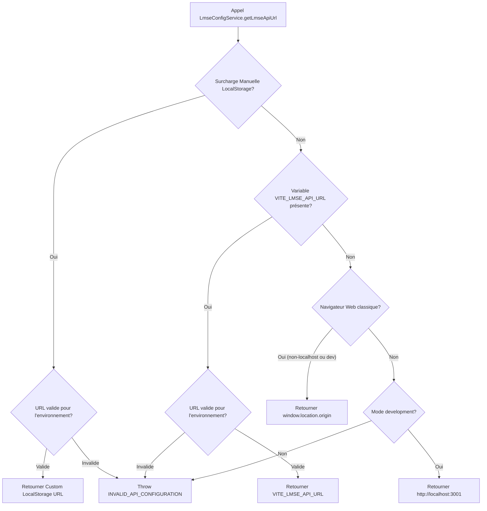

# ARCHITECTURE DES ENDPOINTS LMSE MOBILE & ENVIRONNEMENTS MULTI-CIBLES

**Application** : Bird Academy Enterprise  
**Module** : License Management System Enterprise (LMSE)  
**Version** : v1.2.1-BETA / RC2.5  
**Auteur** : Antigravity Audit & Security Engineering  

---

## 1. Philosophie & Principes Directeurs

L'architecture de configuration des adresses API LMSE repose sur les principes de sécurité et d'isolation suivants :

1. **Interdiction de `localhost` en Bêta et Production** :
   Sur les applications mobiles Android (WebView/Capacitor) et hybrides, la boucle locale `localhost` pointe sur le smartphone lui-même (`127.0.0.1`). Les adresses `localhost`, `127.0.0.1` et `0.0.0.0` sont **strictement proscrites** dans tous les builds destinés aux bêta-testeurs distants ou à la production.
2. **Centralisation par `LmseConfigService`** :
   Tous les modules de l'application (services, moteurs, composants UI) obtiennent l'URL de l'autorité LMSE exclusivement via la méthode officielle :
   ```ts
   LmseConfigService.getLmseApiUrl()
   ```
   Aucun appel `fetch()` n'a le droit d'écrire en dur une adresse de serveur backend.
3. **Garde-Fou au Build (`Build Guard`)** :
   Le script `scripts/validateLmseBuildConfig.js` s'exécute automatiquement avant la compilation Vite (`npm run build:user:*`). Il rejette immédiatement tout build Bêta ou Production dont l'URL API est absente, contient `localhost`, ou utilise un placeholder (`__LMSE_PUBLIC_URL_REQUIRED__`).

---

## 2. Matrice des Environnements

| Environnement Target | Variable `VITE_LMSE_ENV` | Modèle d'URL | Protocole Autorisé | Guard localhost |
| :--- | :--- | :--- | :---: | :---: |
| **`development`** | `development` | `http://localhost:3001` | HTTP / HTTPS | **Autorisé** (Dev local PC) |
| **`android-lan`** | `android-lan` | `http://192.168.X.X:3001` | HTTP / HTTPS | **Interdit** (IP LAN requise) |
| **`beta`** | `beta` | `https://[LMSE_PUBLIC_HOST]` | HTTPS | **Strictement Interdit (FAIL)** |
| **`production`** | `production` | `https://app.bird-academy.fr` | HTTPS | **Strictement Interdit (FAIL)** |

---

## 3. Diagramme de Résolution des URLs API



---

## 4. Fichiers d'Environnement de Référence

- `.env.development` : Configuration de développement local PC.
- `.env.android-lan` : Configuration pour test Wi-Fi LAN entre PC et Smartphone Android.
- `.env.beta` : Modèle de build Bêta exigeant une URL HTTPS distante.
- `.env.production` : Modèle de build de production commerciale.
