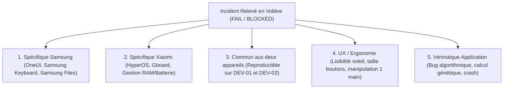

# REGISTRE DES CONSTATS & CADRE D'ANOMALIES TERRAIN ANDROID
## MISSION ANDROID-FIELD-EXECUTION-001 — VOLIÈRE MANAGER v1.3.6

**Rôle :** Senior QA / Release Manager  
**Date :** 2026-09-19  
**Statut :** `DOCUMENTATION READY — AWAITING FIELD OBSERVATIONS`  

---

## 1. CONSTATS INITIAUX DE LA MISSION

| ID Constat | Catégorie | Description du Constat | Impact sur la Recette | Statut |
|---|---|---|---|---|
| **FINDING-FIELD-001** | Environnement Matériel | **Absence d'accès physique aux smartphones par l'agent automatisé :** Antigravity s'exécutant dans un environnement logiciel sans pont matériel tactile, l'exécution directe des manipulations physiques est matériellement impossible. | Déclaration obligatoire : `PHYSICAL EXECUTION : BLOCKED — NO PHYSICAL DEVICE ACCESS`. Interdiction de simuler des résultats. | **ACTIF** |
| **FINDING-FIELD-002** | Intégrité Release | **Conformité cryptographique du binaire APK :** L'empreinte SHA-256 de `dist_binaries/Bird-Academy-User.apk` calculée à `20AD96A27742B4A013FB13774EFFEB716A5E4672509F279AB7D60292251D4F63` est 100% conforme à l'empreinte documentée (`20AD96A27742...`). | Autorisation de déploiement terrain confirmée. Aucune altération du binaire. | **VALIDÉ (PASS)** |
| **FINDING-FIELD-003** | Préconditions Logistiques | **Paramètres matériels et profils en attente d'émargement :** Les modèles exacts des terminaux DEV-01 et DEV-02 ainsi que l'identité des éleveurs pilotes PILOT-01..03 restent à consigner lors de la remise physique. | Sessions initialisées au statut d'attente `[A_CONFIRMER]`. Aucune donnée inventée. | **CONFORME AUX RÈGLES** |

---

## 2. GRILLE DE CLASSIFICATION DES INCIDENTS TERRAIN

Tout dysfonctionnement relevé lors du passage des 32 contrôles sur le terrain doit obligatoirement être classifié selon l'un des 5 axes d'imputabilité technique :



### Typologie détaillée :
1. **Spécifique Samsung :** Lié aux particularités de OneUI (ex. redimensionnement viewport avec le clavier virtuel Samsung, permissions d'accès aux dossiers avec l'app Mes Fichiers).
2. **Spécifique Xiaomi :** Lié aux particularités d'HyperOS / MIUI (ex. coupure agressive de l'app en arrière-plan pendant la mise en veille, restrictions de notifications, gestionnaire de fichiers Xiaomi).
3. **Commun aux deux appareils :** Anomalie reproductible strictement à l'identique sur les deux téléphones (ex. problème de parsing JSON lors de la restauration).
4. **UX / Ergonomie :** Retour qualitatif négatif de l'éleveur sans crash applicatif (ex. libellé confus en arabe, contraste insuffisant en plein soleil dans la volière).
5. **Intrinsèque Application :** Erreur logique dans le moteur métier (ex. mauvais calcul de consanguinité Wright, incohérence de date de ponte).

---

## 3. RÈGLE D'INCIDENT & GABARIT DE SIGNALEMENT

> [!CRITICAL]
> **RÈGLE DU GEL DU CODE MÉTIER :**  
> En aucun cas le code source de l'application ne doit être modifié pendant le déroulement de la campagne de recette.  
> La campagne est une phase d'observation et de certification. Toute non-conformité donne lieu à la rédaction immédiate d'une fiche d'incident `QA_ANDROID_FIELD_INCIDENT_<ID>.md`.

### Gabarit type obligatoire d'incident :
```markdown
# FICHE D'ANOMALIE TERRAIN ANDROID — QA_ANDROID_FIELD_INCIDENT_[ID].md

- **Clé de Traçabilité :** `[SESSION-XX / PILOT-YY / DEV-ZZ / AND-NNN]`
- **Date & Heure :** `[AAAA-MM-JJ HH:MM]`
- **Session ID :** `[SESSION-01 / SESSION-02 / SESSION-03 / SESSION-04]`
- **Participant ID :** `[PILOT-01 / PILOT-02 / PILOT-03]`
- **Terminal ID :** `[DEV-01 (Samsung) / DEV-02 (Xiaomi)]`
- **Modèle Réel :** `[Modèle vérifié dans Paramètres]`
- **Version Android :** `[Version OS et version patch]`
- **ID Contrôle :** `[ex. AND-008 ou AND-021]`
- **Classification :** `[Samsung / Xiaomi / Commun / UX / Intrinsèque]`

### 1. Comportement Observé
[Description factuelle et précise de l'anomalie constatée à l'écran ou au niveau système]

### 2. Comportement Attendu
[Description du comportement requis selon le protocole de test]

### 3. Étapes de Reproduction
1. [Étape 1]
2. [Étape 2]
3. [Étape 3]

### 4. Caractéristiques Techniques
- **Reproductibilité :** [Systématique (100%) / Intermittent / Isolé]
- **Sévérité :** [Critique (Bloquant/Crash) / Majeure / Mineure / Suggestion UX]
- **Impact Métier Élevage :** [Perte de données / Blocage saisie / Gêne visuelle]
- **Fichier de Preuve / Capture :** `[evidence/session_XX/...]`
```
