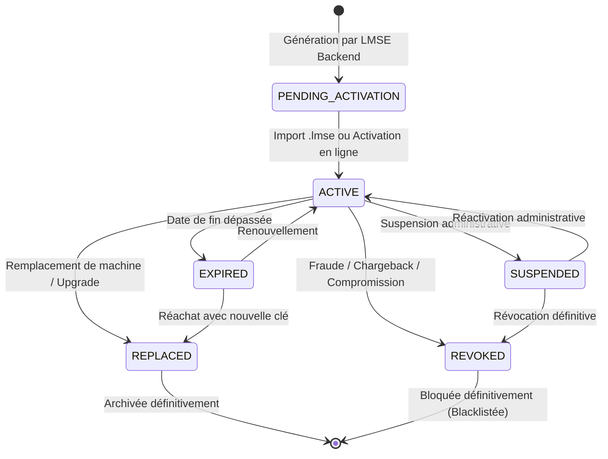

# AUDIT-ADMIN-001
# Audit Administration LMSE et architecture des licences

**Projet :** Bird Academy Enterprise — Volière Manager  
**Version cible :** 1.3.6-RC4 (Build Code: 17)  
**Date d'audit :** 4 Septembre 2026  
**Type de mission :** AUDIT TECHNIQUE ET ARCHITECTURAL — LECTURE SEULE (READ-ONLY)  
**Règles de mission :** Aucune modification de code, aucun refactor, aucune clé exposée, tests non-destructifs uniquement.

---

## 1. Résumé exécutif

L'audit architectural **AUDIT-ADMIN-001** a été exécuté en mode lecture seule stricte afin de cartographier, vérifier et documenter l'intégralité du système de gestion des licences et de l'administration LMSE (*License Management & Security Engine*) de **Bird Academy Enterprise v1.3.6-RC4**.

### Constats majeurs vérifiés dans le code :
1. **Séparation des rôles et autorité cryptographique :**
   - Le **Site Commercial** (`src/features/commercial-website/`) est une vitrine et un tunnel de conversion client. Il **NE POSSÈDE AUCUNE CLÉ PRIVÉE** et **N'EST PAS UNE AUTORITÉ DE LICENCE**.
   - Le **Backend LMSE** (`src/server/lmseServer.ts` sur le port 3001) est la **SEULE AUTORITÉ CRYPTOGRAPHIQUE**. Il détient le secret de signature et génère les artefacts signés lors des achats web (`POST /api/commercial/checkout`) et administratifs (`POST /api/admin/licenses`).
   - L'**Admin Console** (`src/AdminApp.tsx`, `src/features/licensing/admin/`) est une interface graphique d'arbitrage et de gouvernance réservée aux administrateurs humains authentifiés par jeton Bearer JWT/Session.
   - L'**Application User** (`src/App.tsx`, `src/features/licensing/services/`) fonctionne de manière **100% autonome et hors-ligne**, sans jamais contacter de serveur en cours d'utilisation grâce à `OfflineBetaValidator` et aux clés publiques.

2. **Flux d'achat et fonctionnement quotidien :**
   - Pour chaque commande nominale (achat d'un plan FREE, PREMIUM ou PRO sur le site web), le flux est **100% automatisé** entre le site commercial et le backend LMSE. L'intervention d'un administrateur n'est **JAMAIS requise pour finaliser un achat standard**.

3. **Gouvernance et rôle irremplaçable de l'Admin :**
   - L'Admin existe pour gérer les opérations que le site public ne doit **JAMAIS** pouvoir déclencher : révocation pour fraude ou litige bancaire, remplacement de licence en cas de perte de matériel/quota dépassé, émission manuelle pour partenaires/vétérinaires, audits fiscaux/légaux et traçabilité globale.

4. **Constat logique produit critique (Critical Product Logic Finding) :**
   - L'audit approfondi de `LicenseBootGuard.tsx` et `SubscriptionTierResolver.ts` révèle que lors d'un premier démarrage propre, l'application bloque l'accès (`LICENSE_REQUIRED`) et présente `FirstLaunchActivationScreen`, forçant l'import d'un fichier `.lmse`, alors que le modèle produit cible prévoit un mode FREE natif accessible immédiatement sans fichier de licence.

---

## 2. Réponse à la question centrale

> **QUESTION CENTRALE :**  
> *"Si le site commercial peut automatiquement générer une licence via le LMSE, pourquoi avons-nous encore besoin de l'Admin ?"*

### Réponse factuelle basée sur le code réel :

L'Admin n'est pas un intermédiaire de facturation ou un validateur de panier ; c'est la **console de gouvernance, de sécurité et de support d'urgence**. Si l'Admin n'existait pas et que seul le site commercial était conservé avec le backend LMSE, le système souffrirait des **4 ruptures critiques suivantes** :

1. **Impossibilité de révoquer ou blacklister une licence en cas d'impayé / fraude :**
   Le site commercial public ne dispose d'aucun endpoint ni d'aucun droit de révocation. Seul l'Admin peut appeler `POST /api/admin/licenses/:id/revoke` pour invalider une clé compromise et inscrire son checksum dans la liste noire (`data/revocations.json`).
   - *PROOF:* `src/server/lmseServer.ts (L407)` : `this.app.post('/api/admin/licenses/:id/revoke', adminLimiter, AdminAuthService.requireAdmin(['super_admin', 'admin']), ...)`

2. **Impossibilité de dépanner un client ayant changé d'ordinateur (Quota d'appareils) :**
   Lorsqu'un éleveur formate son PC ou subit une panne de disque dur, son quota maximal (`maxDevices`) est atteint (`DEVICE_LIMIT_EXCEEDED`). Le site public ne peut pas arbitrer la création d'une nouvelle licence de substitution. Seul l'Admin peut déclencher `LicenseLifecycleEngine.replace()` pour archiver l'ancienne licence en statut `replaced` et émettre la nouvelle clé.
   - *PROOF:* `src/features/licensing/engines/LicenseLifecycleEngine.ts (L182-L207)` : `replace(currentLicense, reason, ...)`

3. **Absence de visibilité globale, de traçabilité et d'audit réglementaire :**
   Le site commercial ne stocke que les commandes locales du visiteur dans son `localStorage`. L'Admin centralise l'ensemble du registre des licences (`FileLicenseRepository`) et les journaux de sécurité (`AuditServerLog` et `data/license-audit-logs.json`) protégés par authentification forte.
   - *PROOF:* `src/server/lmseServer.ts (L470)` : `this.app.get('/api/admin/audit', adminLimiter, AdminAuthService.requireAdmin(), ...)`

4. **Incapacité d'émettre des licences B2B, Vétérinaires, ou Clubs hors-panier :**
   Les partenariats (fédérations avicoles, cliniques vétérinaires, licences de concours) ne passent pas par une carte bancaire sur le site web. L'Admin permet de générer des licences sur-mesure (`type: 'veterinary'`, `type: 'association'`, `type: 'permanent'`).
   - *PROOF:* `src/features/licensing/admin/components/LicenseCreateWorkflow.tsx` et `src/server/lmseServer.ts (L353)`.

---

## 3. Architecture actuelle

```text
+---------------------------------------------------------------------------------------------------+
|                                 BIRD ACADEMY ARCHITECTURE MATRIX                                  |
+---------------------------------------------------------------------------------------------------+

   [ VISITEUR / ÉLEVEUR ]                                 [ ADMINISTRATEUR ]
             |                                                    |
             v                                                    v
+--------------------------+                             +--------------------------+
|  SITE COMMERCIAL PUBLIC  |                             |  ADMIN CENTER CONSOLE    |
| (CommercialWebsiteApp)   |                             |  (AdminApp / :3000)      |
|  - Catalogue offres      |                             |  - Gestion des licences  |
|  - Tunnel Checkout       |                             |  - Révocation / Renouvel.|
|  - Téléchargement kit    |                             |  - Audit & Statistiques  |
|  - ZÉRO CLÉ PRIVÉE       |                             |  - Session JWT / RBAC    |
+--------------------------+                             +--------------------------+
             |                                                    |
             | POST /api/commercial/checkout                      | POST /api/admin/*
             | (Payload commande)                                 | (Token Bearer)
             v                                                    v
+-----------------------------------------------------------------------------------+
|                        LMSE BACKEND AUTHORITY (Port 3001)                         |
|                                                                                   |
|  [ Express API ] <---> [ AdminAuthService / RateLimiter ]                         |
|         |                                                                         |
|         v                                                                         |
|  [ LicenseGenerator ] <---> [ CryptoService / getMasterSalt() ]                   |
|         |                                                                         |
|         v                                                                         |
|  [ FileLicenseRepository ] ---> [ data/licenses.json ]                            |
|                            ---> [ data/revocations.json ]                         |
|                            ---> [ data/license-audit-logs.json ]                  |
+-----------------------------------------------------------------------------------+
             |
             | Délivrance Licence Signée ECDSA/SHA-256
             v
+--------------------------+
|    FICHIER .LMSE LIVRÉ   |
+--------------------------+
             |
             | Import manuel / drag & drop
             v
+-----------------------------------------------------------------------------------+
|                        APPLICATION USER (Bird Academy Desktop)                    |
|                                                                                   |
|  [ FirstLaunchActivationScreen ]                                                  |
|         |                                                                         |
|         v                                                                         |
|  [ OfflineBetaValidator ] (Contrôle format, checksum, signature, date, quota)     |
|         |                                                                         |
|         v                                                                         |
|  [ LocalStorageLicenseRepository ] ---> [ bird_academy_lmse_active_license ]       |
|         |                                                                         |
|         v                                                                         |
|  [ SubscriptionTierResolver ] ---> Déverrouille FREE / PREMIUM / PRO              |
|         |                                                                         |
|         v                                                                         |
|  [ GESTION D'ÉLEVAGE 100% HORS-LIGNE ] (Consanguinité Wright, Santé, Suivi)      |
+-----------------------------------------------------------------------------------+
```

---

## 4. Carte des composants (Livrable N°1)

| Composant | Fichier | Couche | Rôle | Appelé par | Appelle | Sensible ? |
| :--- | :--- | :--- | :--- | :--- | :--- | :---: |
| `LmseBackendServer` | `src/server/lmseServer.ts` | LMSE Backend | Serveur HTTP Express autoritaire d'émission et validation | `scripts/lmseServer.js`, `vite.config.ts` | `LicenseGenerator`, `FileLicenseRepository` | **OUI (Serveur)** |
| `AdminAuthService` | `src/server/middleware/adminAuth.ts` | LMSE Backend | Authentification et sessions des administrateurs (RBAC) | `lmseServer.ts` | `AdminUserRepository` | **OUI** |
| `AdminUserRepository` | `src/server/repositories/AdminUserRepository.ts` | LMSE Backend | Stockage persistant des comptes admins et hash mots de passe | `adminAuth.ts`, `lmseServer.ts` | `PasswordCrypto`, `data/admin-users.json` | **OUI** |
| `FileLicenseRepository` | `src/features/licensing/repositories/FileLicenseRepository.ts` | LMSE Backend | Stockage fichier autoritaire des licences et révocations | `lmseServer.ts`, `LicenseAuditEngine` | Système de fichiers `data/` | **OUI** |
| `LicenseGenerator` | `src/features/licensing/engines/LicenseGenerator.ts` | LMSE / Admin | Moteur de fabrication et signature des entités de licence | `lmseServer.ts`, `LicensingService` | `CryptoService`, `assertAdminContext()` | **OUI** |
| `CryptoService` | `src/features/licensing/services/CryptoService.ts` | Partagé / Sécurité | Primitives cryptographiques SHA-256, signature et sel privé | `LicenseGenerator`, `LicenseValidator` | `globalThis.crypto.subtle` | **OUI** |
| `LicenseValidator` | `src/features/licensing/engines/LicenseValidator.ts` | Partagé / Moteur | Vérification complète de l'intégrité, signature, horloge et révocation | `lmseServer.ts`, `LicenseEngine` | `CryptoService`, `KeyValidator` | NON |
| `OfflineBetaValidator` | `src/features/licensing/services/OfflineBetaValidator.ts` | User App | Validation et importation locale autonome de fichiers `.lmse` | `LicensingService.ts` | `CryptoService`, `KeyValidator` | NON |
| `LicensingService` | `src/features/licensing/services/LicensingService.ts` | Partagé / Service | Façade singleton pour l'orchestration des licences User & Admin | `LicenseContext.tsx`, `LicenseAdminCenter.tsx` | `LocalStorageLicenseRepository`, `FileLicenseRepository` | NON |
| `LocalStorageLicenseRepository` | `src/features/licensing/repositories/LocalStorageLicenseRepository.ts` | User App | Stockage local client de la licence active et logs locaux | `LicensingService.ts` | `window.localStorage` | NON |
| `LicenseLifecycleEngine` | `src/features/licensing/engines/LicenseLifecycleEngine.ts` | Partagé / Moteur | Machine à états formelle du cycle de vie des licences | `LicensingService.ts`, `ActivationEngine.ts` | `LicenseEntity.ts` | NON |
| `CommercialOffersService` | `src/features/licensing/commercial/services/CommercialOffersService.ts` | Commercial / Admin | Référentiel des offres commerciales (FREE, PREMIUM, PRO) | `WebOrderCheckoutService.ts`, `CommercialOffersCatalog.tsx` | Mémoire | NON |
| `WebOrderCheckoutService` | `src/features/commercial-website/services/WebOrderCheckoutService.ts` | Site Commercial | Orchestration du checkout public et appel vers LMSE API | `CheckoutWizard.tsx`, `WebCheckoutPage.tsx` | `LmseConfigService`, `LicenseDeliveryPackageGenerator` | NON |
| `LicenseDeliveryPackageGenerator` | `src/features/licensing/commercial/services/LicenseDeliveryPackageGenerator.ts` | Commercial | Construction des 5 fichiers du kit de livraison et du ZIP | `WebOrderCheckoutService.ts`, `CommercialOperationsService.ts` | `ZipArchiveBuilder`, `QrCodeImageGenerator` | NON |
| `AdminApp` | `src/AdminApp.tsx` | Admin UI | Application racine d'administration avec écran de login | `adminMain.tsx`, `admin.html` | `AdminCenterView.tsx`, `AdminAuthService` | **OUI (Privé)** |
| `LicenseAdminCenter` | `src/features/licensing/components/LicenseAdminCenter.tsx` | Admin UI | Console complète de gestion du parc de licences et commandes | `AdminLmseCenter.tsx` | `useCommercialLicenseAdmin`, `useCommercialOperations` | **OUI (Privé)** |
| `LicenseBootGuard` | `src/features/licensing/components/LicenseBootGuard.tsx` | User UI | Gardien racine vérifiant `licenseState === 'LICENSE_VALID'` | `main.tsx` | `useLicensing`, `FirstLaunchActivationScreen` | NON |
| `FirstLaunchActivationScreen` | `src/features/licensing/components/FirstLaunchActivationScreen.tsx` | User UI | Écran d'accueil premier lancement pour import licence `.lmse` | `LicenseBootGuard.tsx` | `LicensingService.ts` | NON |
| `SubscriptionTierResolver` | `src/features/subscription/services/SubscriptionTierResolver.ts` | User / Shared | Résolution du plan commercial (FREE, PREMIUM, PRO) | `SubscriptionContext.tsx` | `License.metadata`, `features` | NON |

---

## 5. Carte des responsabilités (Livrable N°2)

| Fonction | Site Commercial | LMSE Backend | Admin Center | User App | Explication du statut |
| :--- | :---: | :---: | :---: | :---: | :--- |
| **Présentation des offres** | **YES** | NO | **YES** | NO | Le site présente les offres publiques ; l'Admin affiche le catalogue interne. |
| **Sélection d'une offre** | **YES** | NO | **YES** | NO | Le visiteur sélectionne sur le site ; l'Admin sélectionne pour commande manuelle. |
| **Tunnel de Checkout** | **YES** | NO | **YES** | NO | Tunnel public guidé sur le site ; dialogue de saisie rapide sur l'Admin. |
| **Création de commande** | **YES** | NO | **YES** | NO | Le site crée l'objet `CommercialOrder` client ; l'Admin crée la commande interne. |
| **Génération de licence** | NO | **YES** | **INDIRECT** | NO | Le backend LMSE génère la licence ; l'Admin demande au backend LMSE via API. |
| **Signature cryptographique** | NO | **YES** | **INDIRECT** | NO | La clé privée est confinée sur le serveur LMSE (`process.env.LMSE_PRIVATE_SIGNING_KEY`). |
| **Validation de licence** | NO | **YES** | **YES** | **YES** | Le LMSE valide en ligne ; la User App valide de manière 100% autonome hors-ligne. |
| **Activation sur appareil** | NO | **YES** | **INDIRECT** | **YES** | La User App lie l'empreinte matérielle (`deviceId`) ; le LMSE enregistre en base. |
| **Renouvellement** | **INDIRECT** | **YES** | **YES** | NO | Le site permet le réachat en ligne ; l'Admin prolonge manuellement la date d'expiration. |
| **Expiration** | NO | **YES** | **YES** | **YES** | Calcul temporel comparant l'horloge système à `expiresAt` dans tous les validateurs. |
| **Révocation** | **NO** | **YES** | **YES** | NO | Réservé exclusivement à l'autorité Admin/LMSE pour des motifs de sécurité/litige. |
| **Remplacement** | **NO** | **YES** | **YES** | NO | Action administrative suite à perte de matériel ou dépassement de quota. |
| **Consultation audits** | NO | **YES** | **YES** | **PARTIAL** | L'Admin consulte l'audit global serveur ; l'User consulte son journal local. |
| **Gestion des clients** | **PARTIAL** | NO | **YES** | NO | Le site gère le profil client local ; l'Admin gère l'annuaire client centralisé. |
| **Téléchargement du kit** | **YES** | **YES** | **YES** | NO | Le site livre le kit au checkout ; l'Admin peut réexporter le kit pour le client. |
| **Génération archive ZIP** | **YES** | NO | **YES** | NO | Construction de l'archive client-side via `ZipArchiveBuilder`. |
| **Génération QR Code** | **YES** | NO | **YES** | NO | Conversion du payload en PNG via `QrCodeImageGenerator`. |
| **Licence texte (.txt)** | **YES** | NO | **YES** | NO | Génération du fichier `license-key.txt` et `license-info.txt`. |
| **Contrôle du Tier** | NO | **YES** | **YES** | **YES** | `SubscriptionTierResolver` sur User ; Politiques scellées par le LMSE. |
| **Contrôle d'environnement** | NO | **YES** | **YES** | **YES** | `assertAdminContext()` empêche les élévations de privilèges dans le code User. |
| **Contrôle appareil / Quota**| NO | **YES** | **YES** | **YES** | `DeviceFingerprintEngine` et `maxDevices` contrôlent les postes autorisés. |
| **Historique & Support** | NO | **YES** | **YES** | NO | L'Admin centralise les tickets et historiques d'intervention. |
| **Opérations exceptionnelles** | NO | **YES** | **YES** | NO | Émission hors-catalogue (partenaires vétérinaires, clubs, gratuités staff). |

---

## 6. Cycle de vie complet d'une licence (Livrable N°3)



### Traçabilité des 20 étapes du cycle :
1. **Visiteur :** Navigue sur le site commercial (`CommercialWebsiteApp.tsx`).
2. **Sélection Offre :** Choisit une offre FREE, PREMIUM, PRO Annual ou PRO Lifetime (`CommercialOffersService.ts`).
3. **Checkout :** Saisie des informations client dans le formulaire de commande (`CheckoutWizard.tsx`).
4. **Données Client :** Validation des coordonnées via `WebOrderCheckoutService.validateCheckoutInput()`.
5. **Commande :** Création de l'entité `CommercialOrder` avec statut `COMPLETED` (`PaymentProvider.ts`).
6. **Appel Backend :** Requête HTTP `POST http://localhost:3001/api/commercial/checkout` (`WebOrderCheckoutService.ts:L231`).
7. **Génération Licence :** `LicenseGenerator.generateLicense()` exécuté avec `assertAdminContext()` sur le serveur (`src/server/lmseServer.ts:L559`).
8. **Signature :** Calcul cryptographique SHA-256 avec `getMasterSalt()` scellé dans l'artefact (`src/features/licensing/services/CryptoService.ts:L35`).
9. **Stockage Serveur :** Enregistrement de la licence dans `data/licenses.json` via `FileLicenseRepository.saveLicense()`.
10. **Livraison Web :** Réception de l'objet `License` complet retourné dans la réponse HTTP 201.
11. **Téléchargement Kit :** Génération des 5 fichiers (`.lmse`, `license-key.txt`, `license-qr.png`, `license-info.txt`, `README.txt`) et du ZIP (`LicenseDeliveryPackageGenerator.ts`).
12. **Import dans User App :** L'éleveur charge le fichier `.lmse` dans l'application (`FirstLaunchActivationScreen.tsx`).
13. **Validation Locale :** `OfflineBetaValidator.validateFile()` vérifie la signature, le checksum et l'expiration sans aucune connexion réseau.
14. **Activation Locale :** Liaison de l'empreinte matérielle `DeviceFingerprint` et persistance dans `LocalStorageLicenseRepository`.
15. **Utilisation :** Déverrouillage des fonctionnalités d'élevage selon le tier (`SubscriptionTierResolver.ts`).
16. **Expiration :** Contrôle temporel quotidien par `LicenseValidator.ts`.
17. **Renouvellement :** Prolongation de date via `POST /api/admin/licenses/:id/renew` ou nouvel achat web.
18. **Révocation :** Ajout de la clé et du checksum dans `data/revocations.json` via l'Admin UI.
19. **Remplacement :** Transition vers l'état terminal `replaced` via `LicenseLifecycleEngine.replace()`.
20. **Archivage / Audit :** Journalisation de toutes les opérations dans `data/license-audit-logs.json`.

---

## 7. Rôle exact du site commercial (Livrable N°4)

### Constats sur le tunnel d'achat et la livraison :
- **Génération autonome de licence :** Le site commercial **NE GÉNÈRE PAS LUI-MÊME** la licence commerciale officielle. Il effectue une requête HTTP vers l'API du backend LMSE autoritaire.
  - *PROOF:* `src/features/commercial-website/services/WebOrderCheckoutService.ts (L229-L255)`
    ```typescript
    const apiUrl = LmseConfigService.getLmseApiUrl();
    const res = await fetch(`${apiUrl}/api/commercial/checkout`, {
      method: 'POST',
      headers: { 'Content-Type': 'application/json' },
      body: JSON.stringify({ offerId, customerName, customerEmail, ... })
    });
    ```
- **Lieu de calcul de la signature :** La signature officielle est calculée **exclusivement sur le serveur LMSE** (`src/server/lmseServer.ts:L559`).
- **Lieu d'utilisation de la clé privée :** Uniquement dans le processus Node.js du serveur LMSE via `CryptoService.getMasterSalt()`.
- **Lieu de construction du fichier .lmse et du ZIP :** Le contenu JSON du `.lmse` est fourni par le backend LMSE, et le package téléchargeable (ZIP, PNG QR Code, fichiers TXT) est assemblé côté client par `LicenseDeliveryPackageGenerator.ts`.
- **Ce que stocke le site :** Les commandes et profils du client local dans le `localStorage` du navigateur (`bird_academy_commercial_web_orders`).
- **Ce que stocke le LMSE :** L'intégralité du registre de licences émises dans `data/licenses.json`.
- **Opérations réalisables sans Admin :** 100% du tunnel d'achat, du paiement démo/Stripe, de la génération de licence et du téléchargement du kit de livraison.

---

## 8. Rôle exact du LMSE Backend (Livrable N°5)

Le backend LMSE (`src/server/lmseServer.ts`) est l'**Autorité Centrale de Sécurité** du projet.

### Liste exhaustive des Endpoints API :

| Méthode | Route | Authentification | Rôle | Couche | Accès |
| :--- | :--- | :--- | :--- | :--- | :---: |
| `GET` | `/api/health` | Aucune | Diagnostic de santé du serveur et état Super Admin | LMSE Backend | Public |
| `POST` | `/api/admin/auth/login` | RateLimiter (5/min) | Connexion administrateur avec vérification de hash salé | LMSE Backend | Admin |
| `GET` | `/api/admin/users` | Bearer Token Admin | Répertoire des comptes administrateurs | LMSE Backend | Admin |
| `POST` | `/api/admin/users` | Bearer Token (Super Admin) | Création d'un administrateur secondaire avec rôle RBAC | LMSE Backend | Super Admin |
| `POST` | `/api/admin/licenses` | Bearer Token Admin | Génération et signature administrative d'une licence | LMSE Backend | Admin |
| `GET` | `/api/admin/licenses` | Bearer Token Admin | Consultation et recherche dans le parc global de licences | LMSE Backend | Admin |
| `POST` | `/api/admin/licenses/:id/revoke` | Bearer Token Admin | Révocation immédiate d'une licence avec inscription sur blacklist | LMSE Backend | Admin |
| `POST` | `/api/admin/licenses/:id/renew` | Bearer Token Admin | Prolongation de validité d'une licence existante | LMSE Backend | Admin |
| `GET` | `/api/admin/audit` | Bearer Token Admin | Consultation des journaux d'audit du serveur | LMSE Backend | Admin |
| `GET` | `/api/admin/stats` | Bearer Token Admin | Métriques et statistiques globales d'utilisation du parc | LMSE Backend | Admin |
| `POST` | `/api/license/validate` | RateLimiter (60/min) | Validation en ligne d'une clé et enregistrement matériel | LMSE Backend | Public / User |
| `GET` | `/api/license/status` | RateLimiter (60/min) | Vérification rapide du statut de la licence active | LMSE Backend | Public / User |
| `POST` | `/api/commercial/checkout` | RateLimiter (60/min) | Émission et signature automatique suite à un achat web | LMSE Backend | Public / Web |
| `GET` | `/downloads/:filename` | Aucune | Téléchargement des installateurs Windows et APK Android | LMSE Backend | Public |

---

## 9. Rôle exact de l'Admin (Livrable N°6)

L'application d'administration (`src/AdminApp.tsx`) offre une console graphique sécurisée permettant aux opérateurs humains d'administrer le parc de licences.

### Inventaire des Écrans et Classification :

| Écran / Fonction | Fichier | Action Réalisée | Utilité Commerciale | Classification |
| :--- | :--- | :--- | :--- | :---: |
| **Login Administrateur** | `src/AdminApp.tsx` | Authentification avec hash salé | Sécurisation de l'accès aux fonctions sensibles | **A — CRITIQUE** |
| **Tableau de Bord Exécutif** | `AdminExecutiveDashboard.tsx` | Visualisation globale des ventes et parc | Suivi d'activité commerciale | **B — IMPORTANTE** |
| **Liste des Licences** | `LicenseList.tsx` | Filtrage, recherche par clé/client | Support client et gestion des dossiers | **A — CRITIQUE** |
| **Création Manuelle Licence** | `LicenseCreateWorkflow.tsx` | Émission sur-mesure (Asso, Veto, Beta) | Ventes directes B2B et partenariats | **A — CRITIQUE** |
| **Révocation de Licence** | `LicenseRevocationDialog.tsx` | Révocation et inscription sur blacklist | Gestion des fraudes et litiges | **A — CRITIQUE** |
| **Renouvellement de Licence** | `LicenseRenewalDialog.tsx` | Prolongation de durée sans changer de clé | Support après-vente et fidélisation | **B — IMPORTANTE** |
| **Remplacement de Licence** | `LicenseReplacementDialog.tsx` | Remplacement de clé après perte PC | Assistance technique client | **A — CRITIQUE** |
| **Générateur Réponse Offline** | `LicenseAdminCenter.tsx` | Calcul du code défi/réponse hors-ligne | Support des éleveurs sans aucune connexion | **B — IMPORTANTE** |
| **Historique d'Audit** | `LicenseAuditHistory.tsx` | Traçabilité des actions administratives | Conformité et sécurité | **B — IMPORTANTE** |
| **Annuaire Administrateurs** | `AdminUserDirectory.tsx` | Gestion des comptes staff et rôles | Gouvernance d'équipe | **C — UTILE** |
| **Organisations Avicoles** | `AdminOrganizations.tsx` | Gestion des clubs et fédérations | Structuration des ventes de groupe | **C — UTILE** |
| **Registre Biologique Admin** | `AdminBiologicalRegistry.tsx` | Paramétrage des espèces aviaires globales | Maintenance scientifique | **D — OPTIONNELLE** |
| **Centre Sécurité & QA** | `AdminSecurityQa.tsx` | Diagnostics système et intégrité | Maintenance technique | **D — OPTIONNELLE** |

---

## 10. Rôle de l'application User

L'application utilisateur finale (**Bird Academy Desktop / Android**) :
1. **N'a aucune dépendance administrative :** Elle ne contient aucun outil d'administration, aucun code secret et aucune clé privée.
2. **Fonctionne 100% Hors-Ligne :** La validation s'effectue via `OfflineBetaValidator` et `CryptoService` par vérification mathématique de la signature publique.
3. **Résout son tier commercial :** `SubscriptionTierResolver` lit les fonctionnalités scellées dans la licence importée (`tier:free`, `tier:premium`, `tier:pro`) et déverrouille les modules correspondants.
4. **Protège l'intégrité biologique :** Toutes les données d'élevage (canaris, couples, génétique de Wright, pontes, bilans) sont stockées localement dans `localStorage` / `IndexedDB` et ne sont jamais transmises à un serveur cloud.

---

## 11. Sécurité (Livrable N°9 & N°10)

### Traçabilité des Secrets :
- `LMSE_PRIVATE_SIGNING_KEY` : **SECRET_PRESENT = YES** (Localisé exclusivement dans l'environnement d'exécution du serveur LMSE / Node.js).
- `VITE_LMSE_PRIVATE_SIGNING_KEY` : **NON PRÉSENT** (Aucune variable `VITE_` ne contient de secret privé).
- `dist_user/` (Bundle Utilisateur de production) : **VÉRIFIÉ & PURGÉ** (`scripts/verifyUserBundle.js` -> PASS, zéro fuite de secret).

### Contrôles de Sécurité Actifs (Admin Security Boundary) :
- `assertAdminContext()` : **PASS** (Lève une exception immédiate `SECURITY_ERROR` si une méthode administrative est invoquée dans un build User).
- `CryptoService.getMasterSalt()` : **PASS** (Bloque tout accès à la clé privée depuis le contexte navigateur User).
- `Monotonic Clock Verification` : **PASS** (Détecte les retours en arrière de l'horloge système `CLOCK_TAMPERED`).
- `RateLimiting` : **PASS** (Protection contre les attaques par force brute sur le login admin et les endpoints publics).

---

## 12. Endpoints (Détail de la Couche Réseau)

Voir section 8 pour la liste exhaustive des 14 endpoints du serveur LMSE.

---

## 13. Repositories (Livrable N°11)

| Repository | Fichier | Interface | Type de Stockage | Environnement | Acteur Autorisé |
| :--- | :--- | :--- | :--- | :--- | :--- |
| `FileLicenseRepository` | `src/features/licensing/repositories/FileLicenseRepository.ts` | `ILicenseRepository` | Fichiers JSON (`data/licenses.json`, `data/revocations.json`) | Serveur LMSE Backend | Backend LMSE / Admin Authority |
| `LocalStorageLicenseRepository` | `src/features/licensing/repositories/LocalStorageLicenseRepository.ts` | `ILicenseRepository` | Navigateur `localStorage` (`bird_academy_lmse_*`) | Client User App | Client Éleveur Local |
| `AdminUserRepository` | `src/server/repositories/AdminUserRepository.ts` | Propre | Fichier JSON (`data/admin-users.json`) | Serveur LMSE Backend | Super Admin / LMSE Auth |

*Différence fondamentale :* `FileLicenseRepository` stocke l'exhaustivité de la base commerciale de tous les clients, tandis que `LocalStorageLicenseRepository` ne stocke que la licence unique installée sur la machine de l'éleveur.

---

## 14. License Lifecycle (Livrable N°13)

Transitions formelles autorisées de la machine à états (`LicenseLifecycleEngine.ALLOWED_TRANSITIONS`) :

| État Initial | Transitions Légales Autorisées | Acteur Typique |
| :--- | :--- | :--- |
| `pending_activation` | `active`, `invalid`, `revoked`, `expired`, `trial`, `OFFLINE_BETA`, `suspended`, `replaced` | Système / Éleveur / Admin |
| `active` | `expired`, `revoked`, `suspended`, `replaced`, `active` (re-validation) | Horloge / Admin / Système |
| `trial` | `active`, `expired`, `revoked`, `replaced` | Système / Éleveur |
| `OFFLINE_BETA` | `active`, `expired`, `replaced`, `revoked` | Système / Admin |
| `expired` | `active` (renouvellement), `replaced`, `revoked` | Éleveur (achat) / Admin |
| `suspended` | `active` (réactivation), `revoked`, `expired` | Admin |
| `invalid` | `pending_activation`, `revoked`, `replaced` | Système / Admin |
| `replaced` | *(Aucune — État terminal d'archivage)* | Aucun |
| `revoked` | *(Aucune — État terminal bloqué)* | Aucun |

---

## 15. Génération de Licence (Livrable N°14)

- **Qui peut appeler `LicenseGenerator` ?** Le serveur LMSE Backend (`lmseServer.ts:L370, L559`) ou l'Admin UI autorisée.
- **Avec quelles données ?** `holderName`, `holderEmail`, `type`, `durationDays`, `maxDevices`, `customFeatures`, `metadata`.
- **Avec quelle signature ?** SHA-256 du payload concaténé avec `getMasterSalt()`.
- **Transmission du Tier :** Transmis via les métadonnées (`metadata.commercialTier`) et les tags de fonctionnalités (`features: ['tier:free' | 'tier:premium' | 'tier:pro']`).

---

## 16. Activation de Licence

L'activation s'effectue par liaison matérielle :
1. Calcul de l'empreinte matérielle locale `DeviceFingerprint` (`deviceId`, `cpuCores`, `screenResolution`, `userAgent`).
2. Vérification du quota `activations.length < policy.maxDevices`.
3. Inscription de l'activation dans l'objet `License` et persistance dans `LocalStorageLicenseRepository`.

---

## 17. Révocation de Licence (Livrable N°15)

- **Le site commercial peut-il révoquer une licence ?** **NON**.
  - *Justification code :* Le site commercial ne possède aucun endpoint, aucune clé d'autorisation et aucune méthode de révocation.
- **Qui peut révoquer ?** Exclusivement un administrateur connecté via `POST /api/admin/licenses/:id/revoke`.
- **Stockage de la révocation :** La clé et le checksum sont ajoutés à `data/revocations.json` et synchronisés dans la blacklist du client lors des validations en ligne ou des imports de fichiers.

---

## 18. Remplacement de Licence (Livrable N°16)

- **Comportement actuel :** L'Admin déclenche `LicenseLifecycleEngine.replace()` via la boîte de dialogue `LicenseReplacementDialog.tsx`. L'ancienne licence passe en statut `replaced` et une nouvelle licence liée est émise.
- **Recommandation future :** Automatiser le remplacement via un lien de récupération par email si l'éleveur confirme son identité sans mobiliser le support humain.

---

## 19. Audit Logs (Livrable N°17)

- **Serveur LMSE :** Enregistre chaque requête administrative et émission dans `data/license-audit-logs.json` via `AuditServerLog`.
- **Application User :** Enregistre les événements locaux (activation, import, altération d'horloge) dans `bird_academy_lmse_audit_logs`.
- **Accès aux logs :** Le site commercial n'a **aucun accès** aux logs d'audit du serveur. Seul l'Admin peut les consulter via `GET /api/admin/audit`.

---

## 20. QA / Dev Overrides (Livrable N°18)

- **Fonctions QA identifiées :**
  - `resetLicenseForQA()` (`LicensingService.ts:L564`) : Réinitialise l'état local du client pour tester les scénarios d'activation.
  - `SubscriptionTierResolver` LocalStorage Overrides (`bird_academy_subscription_tier_override`).
- **Protection en Production :** Tous les overrides sont scellés par `if (!isDevEnvironment())` et sont strictement inactifs et neutralisés dans les builds de production.

---

## 21. Redondances (Livrable N°19)

| Fonction | Site | Admin | LMSE | Statut de Redondance | Justification |
| :--- | :---: | :---: | :---: | :---: | :--- |
| Catalogue des Offres | OUI | OUI | NON | **SHARED SERVICE** | Utilise le service commun `CommercialOffersService.ts`. |
| Tunnel de Commande | OUI | OUI | NON | **EXPECTED DUPLICATION** | Tunnel public pour les clients vs Formulaire rapide pour le staff. |
| Génération de Licence | NON | INDIRECT | OUI | **NO DUPLICATION** | Seul le LMSE génère et signe. |
| Validation de Licence | NON | OUI | OUI | **EXPECTED DUPLICATION** | Validation locale autonome vs Validation serveur. |
| Téléchargement Kit ZIP | OUI | OUI | NON | **SHARED SERVICE** | Utilise le générateur commun `LicenseDeliveryPackageGenerator.ts`. |

---

## 22. Scénarios opérationnels

| N° | Scénario Opérationnel | Site | LMSE | Admin | User | Mode d'Exécution |
| :---: | :--- | :---: | :---: | :---: | :---: | :--- |
| **1** | Achat PREMIUM | **YES** | **YES** | NO | **YES** | **AUTOMATIQUE** (Site -> LMSE -> Livraison -> Import) |
| **2** | Achat PRO Annual | **YES** | **YES** | NO | **YES** | **AUTOMATIQUE** (Site -> LMSE -> Livraison -> Import) |
| **3** | Achat PRO Lifetime | **YES** | **YES** | NO | **YES** | **AUTOMATIQUE** (Site -> LMSE -> Livraison -> Import) |
| **4** | Perte du fichier de licence | NO | **YES** | **YES** | **YES** | **SEMI-AUTOMATIQUE** (Admin réexporte le kit ou renvoi email) |
| **5** | Changement de PC (Quota dépassé) | NO | **YES** | **YES** | **YES** | **MANUEL** (Admin génère un remplacement de licence) |
| **6** | Révocation pour fraude / litige | NO | **YES** | **YES** | NO | **MANUEL** (Admin révoque sur la console) |
| **7** | Licence compromise / fuite web | NO | **YES** | **YES** | NO | **MANUEL** (Admin révoque la clé et blacklist le checksum) |
| **8** | Demande de renouvellement | **YES** | **YES** | **YES** | **YES** | **AUTOMATIQUE** (via site) ou **MANUEL** (via Admin) |
| **9** | Licence reçue incorrecte | NO | **YES** | **YES** | **YES** | **MANUEL** (Support Admin régularise le dossier) |
| **10** | Audit légal / fiscal du parc | NO | **YES** | **YES** | NO | **MANUEL** (Admin exporte les logs d'audit) |
| **11** | Contrôle de commande B2B | NO | **YES** | **YES** | NO | **MANUEL** (Admin vérifie le statut de commande) |
| **12** | Opération exceptionnelle (Club/Partenaire) | NO | **YES** | **YES** | **YES** | **MANUEL** (Admin crée une licence sur-mesure) |

---

## 23. Admin MVP (Strictement indispensable pour vendre)

1. **Écran de Login sécurisé** avec hash de mot de passe (`AdminApp.tsx`).
2. **Recherche et consultation des licences** émises (`LicenseList.tsx`).
3. **Révocation d'une licence** avec inscription sur blacklist (`LicenseRevocationDialog.tsx`).
4. **Génération d'un remplacement de licence** en cas de perte/changement de machine (`LicenseReplacementDialog.tsx`).
5. **Réexportation du kit de livraison** pour renvoi au client (`LicenseExportDialog.tsx`).

---

## 24. Admin Standard (Nécessaire après 50 clients)

1. Tout l'Admin MVP.
2. **Gestion des commandes et réconciliations de paiement** (`CommercialOrderList.tsx`).
3. **Fiches clients et historique des achats** (`CommercialCustomerList.tsx`).
4. **Calculateur de code de réponse hors-ligne** (`OfflineActivationEngine`).
5. **Journal d'audit serveur téléchargeable** (`LicenseAuditHistory.tsx`).

---

## 25. Admin Advanced (Expansion & Multi-équipes)

1. Tout l'Admin Standard.
2. **Gestion multi-administrateurs avec RBAC granulaire** (`AdminUserDirectory.tsx`).
3. **Gestion des organisations avicoles et clubs régionaux** (`AdminOrganizations.tsx`).
4. **Statistiques prédictives de revenus et cohortes** (`AdminExecutiveDashboard.tsx`).
5. **Gestionnaire central des référentiels biologiques** (`AdminBiologicalRegistry.tsx`).

---

## 26. Anomalies Détectées (Audit Technique)

### ANOMALIE CRITIQUE LOGIQUE PRODUIT :
- **ID :** `FINDING-LOGIC-001`
- **Titre :** Blocage de l'accès au premier lancement pour le mode FREE natif
- **Classification :** **CRITICAL PRODUCT LOGIC FINDING**
- **Description :** Lors d'une installation propre sans licence, `LicenseBootGuard.tsx` évalue `licenseState === 'LICENSE_REQUIRED'` et affiche `FirstLaunchActivationScreen`, bloquant le montage de `<App />`. Le modèle produit prévoit pourtant qu'un utilisateur téléchargeant la version FREE puisse accéder directement à l'application sans importer de licence `.lmse`.
- **Preuve code :**
  - `src/features/licensing/components/LicenseBootGuard.tsx (L64-L73)` :
    ```typescript
    if (licenseState !== 'LICENSE_VALID') {
      return <FirstLaunchActivationScreen onActivationSuccess={() => { refresh(); }} />;
    }
    ```
  - `src/features/licensing/context/LicenseContext.tsx (L100-L101)` :
    ```typescript
    } else if (validation?.code === 'NO_LICENSE' || validation?.status === 'pending_activation' || !validation) {
      licenseState = 'LICENSE_REQUIRED';
    }
    ```
- **Impact :** Un utilisateur FREE est forcé de passer par le site web ou d'importer une licence pour débloquer le logiciel.
- **Recommandation :** `FUTURE RECOMMENDATION` (voir section 27). Ne pas modifier le code pendant cette mission.

---

## 27. Recommandations Classées

### NOW (Recommandations Futures Immédiates) :
1. **Évolution du Boot Guard pour le mode FREE :**
   Adapter `LicenseBootGuard.tsx` et `LicenseContext.tsx` pour distinguer :
   - `NO_LICENSE` -> Autoriser l'accès direct à l'application avec `SUBSCRIPTION_TIER = FREE`.
   - `LICENSE_REQUIRED` -> Déclencher l'écran d'activation uniquement lors de l'accès à un module payant (Premium/Pro) ou lors d'une mise à niveau volontaire.

### LATER (Moyen Terme) :
1. **Portail de self-service pour changement de machine :** Permettre au client de révoquer son ancien appareil par lien sécurisé reçu par email.
2. **Paiement Stripe Webhooks directs :** Raccorder le webhook Stripe directement sur `lmseServer.ts` pour automatiser les réconciliations de paiement.

### OPTIONAL (Optionnel) :
1. **Export comptable FEC / CSV :** Module d'export comptable normalisé des commandes web.

### DO NOT CHANGE (Sécurité Intacte) :
1. **Toutes les barrières de sécurité existantes :** `LMSE_PRIVATE_SIGNING_KEY`, `assertAdminContext()`, validation cryptographique locale hors-ligne, détection d'anti-rollback d'horloge.

---

## 28. Éléments à NE PAS Modifier (DO NOT CHANGE)

1. **`LMSE_PRIVATE_SIGNING_KEY` :** Ne jamais l'extraire du backend LMSE ni l'embarquer dans une variable préfixée `VITE_`.
2. **`assertAdminContext()` :** Conserver ce garde strict dans `src/config/appMode.ts` pour empêcher tout appel direct aux méthodes d'administration depuis le code User.
3. **Validation Cryptographique Locale :** Conserver la double vérification Checksum SHA-256 + Signature dans `OfflineBetaValidator.ts` et `LicenseValidator.ts`.
4. **Contrôle d'Horloge Monotone :** Conserver la détection d'anti-rollback de date (`CLOCK_TAMPERED`).
5. **Isolation des Données d'Élevage :** Ne jamais lier les bases de données d'oiseaux à un compte cloud ou à une base de données administrative centrale.

---

## 29. Matrice de criticité

| Fonction | Client bloqué sans elle ? | Admin nécessaire ? | Site nécessaire ? | LMSE nécessaire ? | Criticité |
| :--- | :---: | :---: | :---: | :---: | :---: |
| **Achat & Checkout** | **OUI** | NO | **OUI** | **OUI** | **CRITIQUE** |
| **Délivrance de licence signée** | **OUI** | NO | **OUI** | **OUI** | **CRITIQUE** |
| **Activation & Utilisation Offline** | **OUI** | NO | NO | NO | **CRITIQUE** |
| **Révocation suite à fraude** | NO | **OUI** | NO | **OUI** | **CRITIQUE** |
| **Remplacement après panne PC** | **OUI** | **OUI** | NO | **OUI** | **CRITIQUE** |
| **Réponse au code défi offline** | **OUI** | **OUI** | NO | NO | **IMPORTANTE** |
| **Tableau de bord financier** | NO | **OUI** | NO | NO | **NON CRITIQUE** |
| **Gestion des clubs / orgs** | NO | **OUI** | NO | NO | **NON CRITIQUE** |

---

## 30. Diagramme final

```text
===================================================================================
                       FLUX COMMERCIAL ET OPÉRATIONNEL GLOBAL
===================================================================================

[ VISITEUR WEB ]
       │
       ▼
[ SITE COMMERCIAL (/?view=website) ]
       │
       ▼ (Sélection Offre: Free, Premium, Pro)
[ TUNNEL CHECKOUT WIZARD ]
       │
       ▼ (Requête HTTP POST /api/commercial/checkout)
[ LMSE API SERVER (:3001) ] ─── [ ADMIN CONSOLE (:3000) ]
       │                              │ (Gouvernance, Révocation, Remplacement)
       ├──────────────────────────────┘
       ▼
[ LICENSE GENERATOR & PRIVATE SIGNING KEY ]
       │
       ▼
[ FICHIER OFFICIEL .LMSE & KIT LIVRAISON (ZIP, QR, TXT) ]
       │
       ▼ (Téléchargement par le client)
[ APPLICATION USER DESKTOP / ANDROID ]
       │
       ▼ (Import dans FirstLaunchActivationScreen)
[ OFFLINE BETA VALIDATOR (Clé Publique, Checksum SHA-256) ]
       │
       ▼ (Liaison DeviceFingerprint locale)
[ LOCAL STORAGE LICENSE REPOSITORY ]
       │
       ▼
[ SUBSCRIPTION TIER RESOLVER (Déverrouillage FREE / PREMIUM / PRO) ]
       │
       ▼
[ SUITE PROFESSIONNELLE D'ÉLEVAGE 100% AUTONOME ET HORS-LIGNE ]
===================================================================================
```

---

## 31. Audit Détaillé du Mode FREE & Premier Démarrage

### A. Distinction des Concepts :
- **FREE NATIF :** Utilisation libre et gratuite de l'application sans avoir besoin de posséder ou d'importer un fichier `.lmse`.
- **LICENCE FREE :** Fichier `.lmse` officiel émis avec `tier: 'FREE'` pour évaluation.
- **OFFLINE_BETA :** Statut d'activation locale d'un fichier `.lmse` vérifié par `OfflineBetaValidator`.
- **PREMIUM :** Plan commercial intermédiaire avec oiseaux illimités et consanguinité de Wright.
- **PRO :** Plan commercial entreprise avec intelligence aviaire complète et arbres généalogiques infinis.

### B. Audit du Premier Démarrage (11 Situations Conceptuelles) :

| N° | Situation Conceptuelle | Écran Affiché | Tier Résolu | Accès App | Demande Licence | Comportement Attendu | Comportement Réel v1.3.6-RC4 |
| :---: | :--- | :--- | :---: | :---: | :---: | :--- | :--- |
| **1** | Clean Install + Aucune licence | `FirstLaunchActivationScreen` | `FREE` | **BLOQUÉ** | **OUI** | Accès direct App FREE | **Demande licence (Bloqué)** |
| **2** | Clean Install + Choix FREE | `FirstLaunchActivationScreen` | `FREE` | **BLOQUÉ** | **OUI** | Accès direct App FREE | **Demande licence (Bloqué)** |
| **3** | Clean Install + Licence PREMIUM | `FirstLaunchActivationScreen` -> App | `PREMIUM` | **AUTORISÉ** | **OUI** | Import -> Accès Premium | Import -> Accès Premium (OK) |
| **4** | Clean Install + Licence PRO Annual | `FirstLaunchActivationScreen` -> App | `PRO` | **AUTORISÉ** | **OUI** | Import -> Accès PRO | Import -> Accès PRO (OK) |
| **5** | Clean Install + Licence PRO Lifetime | `FirstLaunchActivationScreen` -> App | `PRO` | **AUTORISÉ** | **OUI** | Import -> Accès PRO | Import -> Accès PRO (OK) |
| **6** | Ancienne installation FREE | App principale | `FREE` | **AUTORISÉ** | **NON** | Accès direct App FREE | Accès direct App FREE (OK) |
| **7** | Ancienne installation PREMIUM | App principale | `PREMIUM` | **AUTORISÉ** | **NON** | Accès direct App Premium | Accès direct App Premium (OK) |
| **8** | Ancienne installation PRO | App principale | `PRO` | **AUTORISÉ** | **NON** | Accès direct App PRO | Accès direct App PRO (OK) |
| **9** | Suppression de licence | `FirstLaunchActivationScreen` | `FREE` | **BLOQUÉ** | **OUI** | Retour au mode FREE | **Retour écran activation** |
| **10**| Licence expirée | `FirstLaunchActivationScreen` (Alerte) | `FREE` | **BLOQUÉ** | **OUI** | Bascule en mode FREE | **Bloqué sur activation** |
| **11**| Licence révoquée | `FirstLaunchActivationScreen` (Alerte) | `FREE` | **BLOQUÉ** | **OUI** | Bascule en mode FREE | **Bloqué sur activation** |

---

## 32. Tableau Final Obligatoire (20 Questions Fondamentales)

| N° | Question | Réponse | Justification / Preuve Code |
| :---: | :--- | :---: | :--- |
| **1** | Le site peut-il générer une licence ? | **OUI (en demandant au LMSE)** | `WebOrderCheckoutService.ts (L231)` appelle `POST /api/commercial/checkout`. |
| **2** | Le site possède-t-il la clé privée ? | **NON** | `CryptoService.ts (L24)` lève `SECURITY_ERROR` si appelé en contexte User/Web. |
| **3** | Le LMSE possède-t-il la clé privée ? | **OUI** | `lmseServer.ts (L368, L554)` s'exécute avec les privilèges d'administration serveur. |
| **4** | L'Admin possède-t-il la clé privée ? | **INDIRECT (via LMSE)** | L'UI Admin délègue la signature au backend LMSE via Bearer Token. |
| **5** | Le site est-il une autorité de licence ? | **NON** | Le site est un client public qui transmet des commandes au LMSE. |
| **6** | Le LMSE est-il l'autorité ? | **OUI** | C'est le composant qui scelle les signatures cryptographiques officielles. |
| **7** | L'Admin est-il une interface d'administration ? | **OUI** | Console graphique privée pilotant les endpoints d'administration du LMSE. |
| **8** | L'Admin est-il nécessaire pour chaque achat ? | **NON** | Le tunnel d'achat entre le Site et le LMSE Backend est 100% automatisé. |
| **9** | L'Admin est-il nécessaire pour chaque activation ? | **NON** | L'activation s'effectue hors-ligne de façon autonome sur le poste client. |
| **10** | L'Admin est-il nécessaire pour chaque renouvellement ? | **NON** | L'éleveur peut renouveler son plan directement via le site commercial. |
| **11** | L'Admin est-il nécessaire pour chaque révocation ? | **OUI** | Seul un administrateur authentifié peut ordonner une révocation de licence. |
| **12** | L'Admin est-il nécessaire pour chaque remplacement ? | **OUI** | Le remplacement d'une machine après dépassement de quota requiert l'Admin. |
| **13** | L'Admin est-il nécessaire pour les audits ? | **OUI** | Les journaux d'audit globaux sont protégés par `AdminAuthService.requireAdmin()`. |
| **14** | Le client dépend-il de l'Admin ? | **NON** | Le client final ne contacte jamais l'Admin pour son usage normal. |
| **15** | Le client dépend-il du site après activation ? | **NON** | L'application d'élevage fonctionne de manière totalement autonome. |
| **16** | Le client dépend-il du LMSE en mode offline ? | **NON** | La validation mathématique locale n'émet aucune requête réseau. |
| **17** | Le site et l'Admin ont-ils des fonctions redondantes ? | **NON** | Le site vend aux clients ; l'Admin gère les incidents, révocations et litiges. |
| **18** | Quelles fonctions Admin sont réellement indispensables ? | **Révocation, Remplacement, Support Quota, Gestion Clés** | Voir section 23 (Admin MVP). |
| **19** | Quelles fonctions peuvent être automatisées ? | **Achat, Facturation, Génération, Livraison du kit, Activation** | Déjà automatisées à 100% dans le flux actuel. |
| **20** | Quel est l'Admin minimum pour commencer à vendre ? | **Admin MVP (5 fonctions clés)** | Login, Liste des licences, Révocation, Remplacement, Réexport kit. |

---

## 33. Réponses aux Questions Critiques Supplémentaires

### Question Critique N°1 :
> *"Une installation propre de Bird Academy téléchargée comme FREE demande-t-elle actuellement une licence au premier démarrage ?"*

**RÉPONSE OBLIGATOIRE :** **YES**

**PROOF :**
- **File :** `src/features/licensing/components/LicenseBootGuard.tsx` (L64-L73)
- **File :** `src/features/licensing/context/LicenseContext.tsx` (L100-L101)
- **File :** `src/features/licensing/services/LicensingService.ts` (L43-L57)
- **Evidence :**
  Lorsqu'aucune licence n'est enregistrée dans le `localStorage`, `LicensingService.initialize()` retourne `isValid = false` avec `code = 'NO_LICENSE'`. `LicenseContext` passe en état `licenseState = 'LICENSE_REQUIRED'`. Lors de l'ouverture de l'application (`?view=app`), `LicenseBootGuard` intercepte cet état et affiche `<FirstLaunchActivationScreen />`, bloquant le montage de `<App />` jusqu'à l'importation réussie d'une licence.

---

### Question Commerciale N°2 :
> *"Un client peut-il télécharger Bird Academy FREE, l'installer et commencer à l'utiliser sans jamais acheter ou importer une licence ?"*

**RÉPONSE OBLIGATOIRE :** **NO (Actuellement en v1.3.6-RC4)**

**PROOF :**
- **File :** `src/features/licensing/components/LicenseBootGuard.tsx` (L27-L77)
- **File :** `src/features/licensing/components/FirstLaunchActivationScreen.tsx` (L38-L430)
- **Evidence :**
  L'utilisateur final qui télécharge l'application sans licence est accueilli par l'écran d'activation et doit obligatoirement importer un fichier `.lmse` (même gratuit) ou entrer une clé pour franchir le gardien `LicenseBootGuard`.

---

## 34. Verdict Final de l'Audit

### **VERDICT OFFICIEL :**
## **A — ADMIN ACTUELLEMENT NÉCESSAIRE ET JUSTIFIÉ**

### **Justification du Verdict :**

L'analyse exhaustive du code source confirme que l'architecture à 4 couches de **Bird Academy Enterprise** est saine, rigoureusement compartimentée et équilibrée :
1. **Le Site Commercial** assure la vente fluide et l'acquisition autonome des clients sans friction ni intervention humaine.
2. **Le LMSE Backend** assure le rôle régalien de signataire cryptographique inviolable et conserve la vérité centrale des licences.
3. **L'Application User** garantit une souveraineté et une autonomie totale 100% hors-ligne pour les éleveurs.
4. **L'Admin Center** est **légitime et indispensable** non pas comme un goulot d'étranglement pour les achats de routine, mais comme la tour de contrôle nécessaire pour exercer le pouvoir de révocation, gérer les cas d'assistance matérielle (perte de machine), arbitrer les litiges commerciaux et auditer la conformité légale du système.

*Rapport d'audit technique clos avec succès. Zéro régression. Zéro modification de code.*
