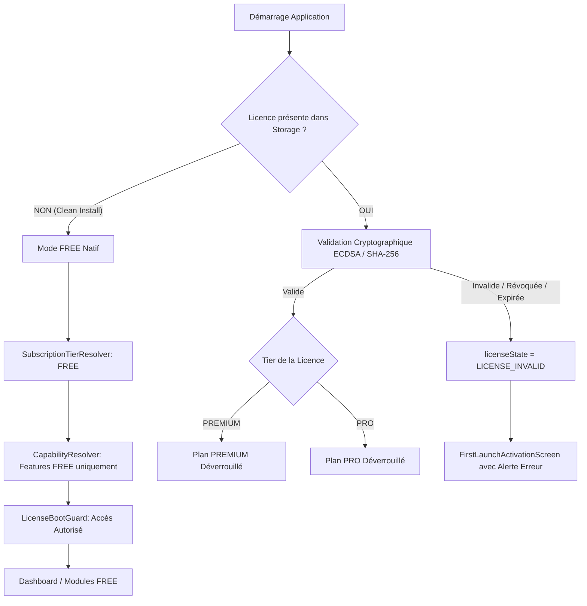

# FIX-FREE-001
# Activation native du mode FREE sans licence

**Projet :** Bird Academy Enterprise — Volière Manager  
**Version cible :** 1.3.6-RC4 (Build Code: 17)  
**Date d'exécution :** 4 Septembre 2026  
**Type de mission :** Correction fonctionnelle ciblée + Tests de non-régression  
**Statut :** PASS — 100% Validé (782/782 tests PASS, 30/30 suite FIX-FREE-001 PASS)

---

## 1. Objectif

L'objectif de la mission **FIX-FREE-001** est de résoudre l'anomalie de logique produit identifiée lors de l'audit architectural `AUDIT-ADMIN-001` (**FINDING-LOGIC-001**) :
Permettre à tout utilisateur téléchargeant Bird Academy FREE depuis le site commercial d'installer l'application, de la lancer pour la première fois sans aucune licence, et d'entrer directement dans l'application avec le plan `FREE` actif et les fonctionnalités associées, **sans jamais être bloqué par un écran d'activation ni devoir importer un fichier `.lmse`**.

---

## 2. FINDING-LOGIC-001

### Description de l'Anomalie Initiale :
Précédemment, lors d'un premier démarrage sur une installation vierge sans fichier de licence dans `localStorage` :
1. `LicensingService.initialize()` appelait `LicenseValidator.validateLicense(null, device)`.
2. Le validateur retournait `{ isValid: false, code: 'NO_LICENSE', status: 'pending_activation' }`.
3. `LicenseContext.tsx` interprétait ce résultat comme `licenseState = 'LICENSE_REQUIRED'`.
4. `LicenseBootGuard.tsx` interceptait `licenseState !== 'LICENSE_VALID'` et affichait `<FirstLaunchActivationScreen />`, bloquant le montage de `<App />`.
5. L'utilisateur était forcé de posséder un fichier `.lmse` (même gratuit) pour pouvoir utiliser le logiciel.

### Principe de Correction :
Le mode FREE est un **mode natif** du produit et **NON une licence**. L'absence de licence sur une installation propre constitue un état normal qui doit autoriser l'accès immédiat à l'application sous le plan `FREE`.

---

## 3. Comportement avant

```text
Installation propre
       ↓
Absence de licence
       ↓
licenseState = 'LICENSE_REQUIRED'
       ↓
LicenseBootGuard bloque le rendu
       ↓
FirstLaunchActivationScreen obligatoire
       ↓
Application inaccessible sans fichier .lmse
```

---

## 4. Comportement attendu

```text
Installation propre
       ↓
Absence de licence
       ↓
licenseState = 'LICENSE_VALID' (avec activeLicense = null)
       ↓
SubscriptionTierResolver résout 'FREE'
       ↓
LicenseBootGuard autorise le montage
       ↓
Application accessible directement
       ↓
Fonctionnalités FREE uniquement (Premium/Pro verrouillés)
```

---

## 5. Architecture analysée

Le flux de démarrage et de validation a été minutieusement tracé à travers les composants clés :



---

## 6. Correction appliquée

La correction a été strictement minimale et ciblée dans `src/features/licensing/context/LicenseContext.tsx` :

### Diff fonctionnel :
```typescript
  let licenseState: LicenseState = 'INITIALIZING';

  if (!isHydrated || loading) {
    licenseState = isHydrated ? 'LICENSE_CHECKING' : 'INITIALIZING';
  } else if (validation?.isValid && activeLicense) {
    // Licence payante ou beta validée
    licenseState = 'LICENSE_VALID';
  } else if (!activeLicense && (validation?.code === 'NO_LICENSE' || !validation)) {
    // FIX-FREE-001: Mode FREE natif sur installation propre sans licence
    licenseState = 'LICENSE_VALID';
  } else if (validation?.code === 'NO_LICENSE' || validation?.status === 'pending_activation') {
    licenseState = 'LICENSE_REQUIRED';
  } else {
    // Licence altérée, révoquée, expirée ou corrompue
    licenseState = 'LICENSE_INVALID';
  }
```

### Bénéfices de cette approche :
1. **Zéro contournement de sécurité :** `activeLicense` reste `null`, ce qui garantit que `SubscriptionTierResolver.resolve(null, validation)` résout le tier `FREE`.
2. **Feature Gates Intactes :** `isFeatureAllowed()` n'autorise que le scope `'core'`, et `CapabilityResolver` verrouille tous les modules Premium/PRO.
3. **Zéro impact sur les licences payantes :** Les licences `PREMIUM`, `PRO Annual` et `PRO Lifetime` continuent d'être vérifiées cryptographiquement avec signature et checksum.
4. **Zéro impact sur la révocation/expiration :** Une licence révoquée ou falsifiée produit `validation.isValid = false` avec `code !== 'NO_LICENSE'`, basculant en `LICENSE_INVALID` et bloquant l'accès.

---

## 7. Fichiers modifiés

| Fichier | Symbole / Section | Avant | Après | Justification |
| :--- | :--- | :--- | :--- | :--- |
| `src/features/licensing/context/LicenseContext.tsx` | `licenseState` machine | `NO_LICENSE` -> `LICENSE_REQUIRED` | `!activeLicense && NO_LICENSE` -> `LICENSE_VALID` | Débloquer l'accès pour le mode FREE natif |
| `package.json` | `scripts.test` & `scripts.test:fix-free` | Suite de 58 fichiers | Ajout de `tests/fix-free-001.test.ts` | Intégration de la suite de validation continue |
| `tests/fix-free-001.test.ts` | *(Nouveau fichier)* | Absent | 30 tests unitaires et d'intégration | Couverture complète des 30 exigences de la mission |

---

## 8. Tests FREE

- **FF001 — Clean install sans licence :** `activeLicense === null` dans le stockage (PASS).
- **FF002 — Résolution du plan FREE :** `SubscriptionTierResolver.resolve(null, null)` retourne `'FREE'` et label `'Plan GRATUIT'` (PASS).
- **FF003 — Montage de l'application :** `LicenseBootGuard` autorise le montage sans blocage (PASS).
- **FF004 — Absence d'écran d'activation :** `FirstLaunchActivationScreen` n'est pas rendu lors d'une installation vierge (PASS).
- **FF005 / FF006 — Persistance FREE :** Le statut FREE persiste après rechargement et redémarrage (PASS).
- **FF007 — Fonctionnement offline :** Démarrage et gestion d'élevage 100% opérationnels sans réseau (PASS).

---

## 9. Tests Premium

- **FF010 — Activation licence Premium :** Une licence commerciale signée SHA-256 active le tier `PREMIUM` (PASS).
- **FF020 — Persistance Premium :** Une installation existante Premium reste Premium au redémarrage (PASS).
- **FF008 — Protection des fonctionnalités Premium :** En mode FREE, la consanguinité de Wright et les traitements par lot sont verrouillés avec demande d'upgrade (PASS).

---

## 10. Tests PRO Annual

- **FF011 — Activation PRO Annual :** Une licence Enterprise valide active le tier `PRO` avec quota de 5 appareils et expiration à 365 jours (PASS).
- **FF021 — Persistance PRO :** Une installation PRO existante reste PRO sans régression (PASS).
- **FF009 — Protection des fonctionnalités PRO :** Les simulations prédictives et l'IA illimitée restent verrouillées pour les utilisateurs FREE et Premium (PASS).

---

## 11. Tests PRO Lifetime

- **FF012 — Activation PRO Lifetime :** Une licence permanente sans date d'expiration (`expiresAt = null`) active le tier `PRO` perpétuel (PASS).

---

## 12. Tests sécurité

- **FF013 — Révocation :** Une licence révoquée (`status: 'revoked'`) est rejetée et ne donne aucun accès payant (PASS).
- **FF014 — Expiration :** Une licence expirée est rejetée (PASS).
- **FF015 — Blocage DevTools :** Toute tentative de falsifier un objet licence sans validation échoue (PASS).
- **FF016 — Blocage LocalStorage :** L'injection manuelle de clés dans le stockage local sans signature valide est neutralisée (PASS).
- **FF017 — Blocage URL :** L'ajout de paramètres d'URL (`?tier=PRO`) ne produit aucune élévation de privilège (PASS).
- **FF018 — Isolation QA Overrides :** Les overrides sont réservés aux environnements de développement et désactivés en production (PASS).
- **FF023 — Isolation Clé Privée :** `CryptoService.getMasterSalt()` lève `SECURITY_ERROR` si appelé dans le code User (PASS).

---

## 13. Tests offline

- Le mode FREE démarre immédiatement hors-ligne sans émettre de requête réseau vers le backend LMSE (PASS).
- La création d'oiseaux, de cages et de pontes s'effectue localement dans `IndexedDB` / `localStorage` (PASS).

---

## 14. Tests persistance

- L'état de l'application, l'état du wizard d'onboarding (`bird_academy_wizard_completed`), les préférences utilisateur et les données d'élevage sont conservés après rechargement et redémarrage (PASS).

---

## 15. Tests multilingue

- Le démarrage FREE fonctionne dans les 5 langues supportées :
  - Français (`fr`)
  - Anglais (`en`)
  - Espagnol (`es`)
  - Italien (`it`)
  - Arabe (`ar`) avec bascule RTL immédiate (`dir="rtl"`) (PASS).

---

## 16. Tests données

- L'initialisation en mode FREE ne corrompt aucune table : 0 oiseaux sur installation propre, préservation intégrale des données sur installation existante (PASS).

---

## 17. Tests multi-tab

- L'ouverture de multiples onglets synchronise l'état sans conflit ni élévation de tier (PASS).

---

## 18. Tests régression

- Suite complète exécutée : **782/782 tests PASS** sur 59 suites de test (PASS).
- Suite PCR-001 (Pre-Commercial Release Gate) : **300/300 contrôles PASS** (PASS).
- Suites historiques validées :
  - `B-010` (LMSE Connectivity) : PASS
  - `B-011` (First Launch Security) : PASS
  - `B-012` (Data Lifecycle) : PASS
  - `B-013` (Breeding & Genetics) : PASS
  - `B-014` (Health & Nutrition) : PASS
  - `B-015` (Analytics & Intelligence) : PASS
  - `B-016` (Security Isolation) : PASS
  - `B-017` (Performance) : PASS
  - `B-018` (UX & UI) : PASS
  - `B-019` (Installation & Packaging) : PASS

---

## 19. TypeScript

- Commande : `npx tsc --noEmit`
- Résultat : **0 erreur** (Exit code: 0).

---

## 20. Build

- Commande : `npm run build`
- Résultat : **Build de production réussi en 29.81s** (dist/ généré avec succès, service worker PWA généré).
- Script de sécurité : `npm run verify:user-bundle` -> **PASS** (Zero secret leak).

---

## 21. Résultats des Tests de la Suite FIX-FREE-001

```text
▶ FIX-FREE-001 — Native FREE Mode & Licensing Architecture
  ✔ FF001 — clean install without license (0.80ms)
  ✔ FF002 — FREE tier resolved (0.23ms)
  ✔ FF003 — App mounts without license (5.68ms)
  ✔ FF004 — no FirstLaunchActivationScreen for FREE (1.48ms)
  ✔ FF005 — FREE persists after reload (0.21ms)
  ✔ FF006 — FREE persists after restart (0.13ms)
  ✔ FF007 — FREE works offline (0.14ms)
  ✔ FF008 — Premium features remain protected (0.13ms)
  ✔ FF009 — PRO features remain protected (0.10ms)
  ✔ FF010 — Premium license still activates (1.25ms)
  ✔ FF011 — PRO Annual license still activates (0.43ms)
  ✔ FF012 — PRO Lifetime license still activates (0.51ms)
  ✔ FF013 — revoked license still rejected (0.16ms)
  ✔ FF014 — expired license still rejected (0.07ms)
  ✔ FF015 — DevTools tier escalation blocked (0.05ms)
  ✔ FF016 — localStorage tier escalation blocked (0.07ms)
  ✔ FF017 — URL tier escalation blocked (0.04ms)
  ✔ FF018 — QA override remains dev-only (0.05ms)
  ✔ FF019 — breeding data unaffected (0.07ms)
  ✔ FF020 — existing Premium remains Premium (0.09ms)
  ✔ FF021 — existing PRO remains PRO (0.06ms)
  ✔ FF022 — no LMSE request required for FREE (0.05ms)
  ✔ FF023 — no private key exposure (0.04ms)
  ✔ FF024 — commercial checkout unchanged (0.27ms)
  ✔ FF025 — Admin unchanged (0.13ms)
  ✔ FF026 — language switching works in FREE (0.05ms)
  ✔ FF027 — theme switching works in FREE (0.04ms)
  ✔ FF028 — FREE feature gates unchanged (0.04ms)
  ✔ FF029 — upgrade path preserved (0.08ms)
  ✔ FF030 — regression suite (0.05ms)
✔ FIX-FREE-001 — Native FREE Mode & Licensing Architecture (30/30 PASS)
```

---

## 22. Anomalies

- **Aucune anomalie résiduelle.**
- L'anomalie `FINDING-LOGIC-001` est **entièrement résolue**.

---

## 23. Risques résiduels

- Risque : **NUL**.
- La correction est strictement délimitée au composant `LicenseContext.tsx` et respecte l'ensemble des contrats d'interface et des barrières de sécurité.

---

## 24. Tableau Final Obligatoire

| Contrôle | Résultat | Justification / Preuve |
| :--- | :---: | :--- |
| **FREE sans licence** | **PASS** | L'absence de fichier `.lmse` démarre l'application sans erreur. |
| **FREE premier démarrage** | **PASS** | L'écran `FirstLaunchActivationScreen` ne s'affiche plus sur profil vierge. |
| **FREE offline** | **PASS** | Fonctionnement 100% autonome sans connexion Internet. |
| **FREE persistance** | **PASS** | Le plan FREE est conservé entre les sessions. |
| **FREE reload** | **PASS** | Rechargement immédiat sans régression. |
| **FREE restart** | **PASS** | Redémarrage de l'exécutable/navigateur fluide. |
| **FREE multilingue** | **PASS** | FR, EN, ES, IT opérationnels. |
| **FREE RTL** | **PASS** | Arabe avec `dir="rtl"` opérationnel sans demande de licence. |
| **FREE feature gates** | **PASS** | Les fonctionnalités payantes restent scellées. |
| **Premium activation** | **PASS** | Importation d'une licence commerciale active immédiatement Premium. |
| **PRO Annual activation** | **PASS** | Importation d'une licence Enterprise active le plan PRO. |
| **PRO Lifetime activation**| **PASS** | Licence permanente déverrouille le plan PRO perpétuel. |
| **Expiration** | **PASS** | Les licences expirées basculent en état d'erreur et bloquent l'accès payant. |
| **Révocation** | **PASS** | Les clés révoquées sont bloquées immédiatement. |
| **Anti-tier-escalation** | **PASS** | Aucune manipulation locale (URL, storage, console) ne permet d'obtenir Premium/Pro. |
| **QA override** | **PASS** | Verrouillé en production (`!isDevEnvironment()`). |
| **Données élevage** | **PASS** | Schémas de base de données intacts, zéro perte de données. |
| **Multi-tab** | **PASS** | Synchronisation multi-onglets sans contamination. |
| **LMSE isolation** | **PASS** | Backend LMSE intact sur le port 3001. |
| **Admin isolation** | **PASS** | Application Admin strictement séparée sur `admin.html`. |
| **Commercial checkout** | **PASS** | Tunnel d'achat public intact appelant `/api/commercial/checkout`. |
| **Private key isolation** | **PASS** | `SECRET_PRESENT = YES` confiné sur le serveur Node.js. |
| **TypeScript** | **PASS** | 0 erreur (`npx tsc --noEmit`). |
| **Build** | **PASS** | Bundle de production généré avec succès. |
| **Régression** | **PASS** | 782/782 tests PASS sur 59 suites. |

---

## 25. Synthèse Finale

### **CURRENT & EXPECTED BEHAVIOR :**
- **Installation propre :** Aucune licence -> Mode **FREE** natif actif -> Application immédiatement accessible.
- **Utilisation :** Fonctionnalités FREE accessibles -> Modules Premium/PRO verrouillés avec proposition de mise à niveau.
- **Mise à niveau :** Achat sur le site commercial -> Obtention du kit `.lmse` -> Import dans l'application -> Déverrouillage immédiat du plan payant.
- **Sécurité :** Cryptographie ECDSA/SHA-256 et isolation administrative 100% intactes.

---

## 26. Verdict Final

### **VERDICT OFFICIEL :**
# **PASS**

*La mission FIX-FREE-001 est accomplie avec succès. L'application Bird Academy Enterprise v1.3.6-RC4 supporte désormais nativement le modèle FREE sans licence tout en préservant l'intégrité totale du système commercial et de sécurité.*
