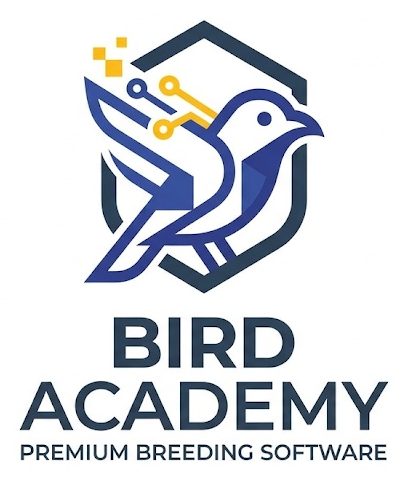

# Bird Academy Enterprise — Volière Manager

<div align="center">
  
  <p><strong>Plateforme Professionnelle de Gestion d'Élevage Avicole, Génétique & Suivi Biologique</strong></p>
  <p><em>Version 1.3.6 — Commercial Release Candidate</em></p>
</div>

---

## 1. PRÉSENTATION DU PRODUIT

**Bird Academy Enterprise (Volière Manager)** est une suite logicielle complète conçue pour les éleveurs d'oiseaux (canaris de posture, couleur et chant, chardonnerets, exotiques, perruches), les associations ornithologiques, les centres vétérinaires et les professionnels de l'aviculture.

L'application combine la rigueur du suivi zootechnique, des moteurs génétiques avancés (calcul de consanguinité de Wright, prévisions d'accouplements) et une gestion financière et administrative rigoureuse.

---

## 2. INVARIANTS ARCHITECTURAUX & SOUVERAINETÉ DES DONNÉES

- **Architecture 100% Offline-First** : L'application fonctionne en toute autonomie locale sans nécessiter de connexion Internet pour le démarrage, la gestion du cheptel, les calculs génétiques ou la génération des rapports.
- **Stockage Local Souverain** : Toutes les données d'élevage (oiseaux, bagues, couples, pontes, soins, transactions) sont conservées exclusivement sur l'appareil de l'utilisateur (IndexedDB / LocalStorage).
- **Politique Monocellulaire (Single-Device)** : Aucune synchronisation cloud multi-appareils non maîtrisée en V1.x, garantissant une étanchéité totale et la non-divulgation des données d'élevage.
- **Sauvegarde Cryptographique Haute Sécurité** : Sauvegardes complètes chiffrées en **AES-GCM 256 bits** avec dérivation de clé PBKDF2, sel et IV uniques, et compression **Gzip** intégrée.

---

## 3. MODÈLE COMMERCIAL & TIERS DE LICENCE

Bird Academy Enterprise intègre un système d'activation de licence décentralisé **LMSE** reposant sur des signatures cryptographiques asymétriques **ECDSA (courbe P-256)** :

- **Plan GRATUIT (FREE Natif)** :
  - Opérationnel immédiatement dès l'installation propre sans aucune licence requise.
  - Aucune carte bancaire, aucun compte en ligne, aucune connexion obligatoire.
  - Accès complet aux 14 modules fondamentaux : Oiseaux, Cages/Volières, Couples, Reproduction, Santé, Alimentation, Finances de base, Calendrier, Référentiel biologique, Sauvegarde/Restauration.
- **Plan PASSION (PREMIUM)** :
  - Débloque le cheptel illimité, le calcul de consanguinité de Wright, les traitements sanitaires groupés par lot, les fiches diagnostics et les rapports financiers avancés.
- **Plan ENTERPRISE (PRO)** :
  - Débloque le moteur d'intelligence décisionnelle complet (*Bird Intelligence Engine*), les alertes sanitaires prédictives, les simulations généalogiques multi-générationnelles et les exports analytiques certifiés.

---

## 4. MODULES FONCTIONNELS

1. **Tableau de Bord Stratégique** : Synthèse d'élevage en temps réel, indicateurs de ponte, alertes vétérinaires urgentes.
2. **Gestion du Cheptel (Oiseaux)** : Fiches individuelles, baguage officiel, phénotypes, mutations, antécédents et statut (actif, cédé, décédé).
3. **Cages & Habitats** : Gestion spatiale des volières, taux d'occupation, densité, protocoles de nettoyage et QR codes de cages.
4. **Reproduction & Filiation** : Cycles de ponte, numérotation séquentielle des œufs, jalons automatiques (Mirage J+6, Éclosion J+13), baguage des poussins.
5. **Nurserie & Élevage à la Main (EAM)** : Suivi pondéral des oisillons, pesées quotidiennes, surveillance du jabot et sevrage progressif.
6. **Santé & Soins Vétérinaires** : Registre des observations cliniques, ordonnances, rappels de vaccination et traitements collectifs.
7. **Alimentation & Nutrition** : Rations adaptées aux cycles biologiques (Repos, Reproduction, Mue), surveillance des stocks et alertes de rupture.
8. **Gestion Financière & Cessions** : Comptabilité analytique des charges, registre officiel des cessions et édition immédiate des attestations de cession A4.
9. **Calendrier Avicole Dynamique** : Planification des pontes prévisionnelles, des mirages, des éclosions et des rappels sanitaires.
10. **Statistiques & Centre de Décision** : Courbes de fertilité, taux de réussite au sevrage, répartition financière et performance génétique.
11. **Générateur de Rapports & Exports Multi-Pages** :
    - Rapports PDF vectoriels conformes `%PDF-1.4` avec pagination dynamique multi-pages (règle stricte : *Source Count = Export Input = Rendered Count*).
    - Exports CSV normalisés pour Microsoft Excel FR (encodage UTF-8 avec BOM `\uFEFF`, séparateur point-virgule `;`, échappement RFC 4180).
12. **Support Multilingue & RTL** :
    - 5 langues supportées : Français, English, العربية (avec inversion complète de direction RTL), Español, Italiano.
    - Base de connaissances d'aide intégrée de 90 articles exhaustifs.

---

## 5. PLATES-FORMES & PACKAGING

- **Windows Desktop** :
  - Exécutable Installateur NSIS : `Bird-Academy-User-Windows-Setup.exe`
  - Exécutable Portable : `Bird-Academy-User.exe`
  - Moteur : Electron 43 avec préchargement sécurisé (`contextBridge`, `nodeIntegration: false`, `contextIsolation: true`).
- **Mobile Android** :
  - Package APK autonome : `Bird-Academy-User.apk`
  - Moteur : Capacitor 7 avec détection native de plateforme (`capacitor:` protocol).
- **Web & PWA** :
  - Manifeste Web PWA et Service Worker Workbox avec pré-mise en cache pour exécution hors ligne.

---

## 6. PRÉREQUIS & DÉVELOPPEMENT

### Prérequis
- **Node.js** >= 20.x (Node v24 recommandé)
- **npm** >= 10.x

### Installation des dépendances
```bash
npm install
```

### Lancement en mode développement
```bash
npm run dev
```
L'application démarre sur `http://localhost:3000`.

### Compilation du build de production
```bash
npm run build
```
Génère les artefacts optimisés dans `dist/` avec le service worker PWA et le manifeste.

### Vérification du typage TypeScript
```bash
npx tsc --noEmit
```

---

## 7. SUITES DE TESTS & VALIDATION QUALITÉ

### Tests Unitaires & Intégration
```bash
# Validation du mode FREE natif
npm run test:fix-free

# Validation du fonctionnement Android Capacitor
npm run test:android-free

# Validation de l'étanchéité des tiers commerciaux FREE / PREMIUM / PRO
node --import tsx --test tests/commercial-tiers-001.test.ts

# Validation de la réinitialisation QA sans perte de données
node --import tsx --test tests/qa-free-clean-001.test.ts

# Validation de la pagination multi-pages des rapports PDF
node --import tsx --test tests/report-expenses-fix-001.test.ts
```

### Tests End-to-End Navigateur (Playwright Test)
```bash
# Exécution de la suite complète Playwright sous Chromium
npx playwright test tests/e2e/operational-readiness-001.spec.ts
```

---

## 8. LICENCE & MENTIONS LÉGALES

- **Éditeur** : Bird Academy Enterprise
- **Copyright** : © 2026 Bird Academy. Tous droits réservés.
- **Code Source Application** : Sous licence propriétaire et commerciale Bird Academy Enterprise.
