# AUDIT ARCHITECTURE & QA : SPECIES PROFILE CONSISTENCY & DATA SCOPING

**Date de l'audit** : 2026-08-24  
**Projet** : Bird Academy Enterprise — Avian ERP (Windows RC3)  
**Auteur** : Lead Architect & QA Lead AI  
**Statut de la phase** : **PHASE 1 : AUDIT UNIQUEMENT (AUCUNE MODIFICATION DE CODE)**  

---

## 1. Executive Summary

L'application **Bird Academy Enterprise** intègre un assistant de premier lancement (**Welcome Wizard**) qui invite l'éleveur à configurer son profil en sélectionnant explicitement les espèces et races qu'il élève (ex: *Canari*, *Chardonneret élégant*).

L'audit architectural approfondi révèle une déconnexion critique entre cette étape de configuration initiale et le reste du système applicatif :
1. **Perte d'état au Wizard** : La sélection d'espèces opérée à l'étape 4 du `WelcomeWizard` n'est jamais persistée dans le stockage local (`localStorage`) ni dans aucun repository lors de la validation finale (`handleFinish`).
2. **Absence de couche de scoping unifiée** : Aucun service centralisé de profil d'espèce (`SpeciesProfileService`) n'existe.
3. **Générateur de démo aveugle** : L'outil `DemoDataGenerator` génère systématiquement et de manière codée en dur 4 espèces distinctes (*Canari*, *Chardonneret*, *Diamant Mandarin*, *Diamant de Gould*), ignorant totalement le profil choisi par l'utilisateur.
4. **Fuite globale des référentiels maîtres** : Les modules métiers (Biologie, Santé, Nutrition, Reproduction, Génétique, Intelligence, Rapports, Formulaires UI) importent et itèrent directement sur l'intégralité des registres maîtres `SPECIES_REGISTRY` et `BIOLOGICAL_SPECIES_REGISTRY` au lieu de filtrer sur le profil d'espèce actif.

L'objectif de cette mission est de concevoir l'architecture permettant à l'application de devenir **strictement "profile-scoped"**, tout en conservant **l'intégrité complète et immuable des référentiels biologiques maîtres** pour l'administration et les extensions futures.

---

## 2. Current Architecture

### 2.1 Schéma de l'Architecture Actuelle (Non Scratifiée / Fuite Globale)

```
┌────────────────────────────────────────────────────────────────────────┐
│                        MASTER REGISTRIES                               │
│  - SPECIES_REGISTRY (Canari, Chardonneret, Mandarin, Gould, etc.)      │
│  - BIOLOGICAL_SPECIES_REGISTRY (8 profils scientifiques complets)      │
└──────────────────┬─────────────────────────────────┬───────────────────┘
                   │ Direct Unfiltered Imports        │ Direct Unfiltered Imports
                   ▼                                 ▼
┌─────────────────────────────────────┐  ┌───────────────────────────────┐
│        WelcomeWizard (UI)           │  │   DemoDataGenerator (Seeder)  │
│  - Step 4: selectedSpecies en mémoire│  │   - Hardcoded 4 species       │
│  - handleFinish(): DROPS SPECIES!   │  │   - rand(species) sans profil │
└─────────────────────────────────────┘  └───────────────────────────────┘
                   │                                 │
                   ▼ (Pas de profil sauvegardé)      ▼ (Pollution multi-espèces)
┌────────────────────────────────────────────────────────────────────────┐
│                     APPLICATION RUNTIME STATE                          │
│  - BirdRepository / BirdService (Accepte toute espèce du registre)    │
│  - ReferenceBiologique (Affiche les 8 onglets maîtres inconditionnels) │
│  - Sante / Nutrition / Reproduction / Intelligence (Global non-scopé)  │
│  - UI Selectors / Filters (Menus déroulants sur SPECIES_REGISTRY brut) │
└────────────────────────────────────────────────────────────────────────┘
```

### 2.2 Analyse des Flux de Dépendance
- Chaque composant accède directement aux constantes globales `SPECIES_REGISTRY` (dans `src/data/speciesRegistry.ts`) ou `BIOLOGICAL_SPECIES_REGISTRY` (dans `src/reference/species/index.ts`).
- Aucun composant ne consulte un contexte de session ou un profil utilisateur pour restreindre les espèces affichées.

---

## 3. Wizard Data Flow

### 3.1 Localisation du Code
- Fichier : [`src/features/quality/components/WelcomeWizard.tsx`](file:///d:/app%20canaris/28+/src/features/quality/components/WelcomeWizard.tsx)

### 3.2 Analyse Étape par Étape

1. **Initialisation de l'état (Lignes 47–49)** :
   ```typescript
   const [selectedSpecies, setSelectedSpecies] = useState<string[]>(['canari']);
   const [selectedBreeds, setSelectedBreeds] = useState<string[]>([]);
   ```
2. **Étape 4 : Sélection des Espèces (Lignes 554–630)** :
   - L'interface propose des cartes interactives pour `canari`, `chardonneret_elegant`, `mandarin`, `diamant_gould`, `perruche_ondulee`, `agapornis`, `calopsitte_elegante`.
   - L'utilisateur bascule les cases à cocher, ce qui modifie l'état local React `selectedSpecies`.
3. **Étape 7 : Oiseau Fondateur Initial (Lignes 854–864)** :
   - La liste déroulante `<select>` pour choisir l'espèce de l'oiseau fondateur itère directement sur `SPECIES_REGISTRY` complet :
     ```tsx
     {SPECIES_REGISTRY.map(s => (
       <option key={s.id} value={s.id}>{s.defaultLabel}</option>
     ))}
     ```
   - **Anomalie** : L'utilisateur peut sélectionner une espèce qu'il a expressément décochée à l'étape 4 !
4. **Finalisation `handleFinish()` (Lignes 304–326)** :
   ```typescript
   const handleFinish = () => {
     localStorage.setItem('bird_academy_wizard_completed', 'true');
     if (aviaryName) localStorage.setItem('bird_academy_aviary_name', aviaryName);
     if (breederName) localStorage.setItem('bird_academy_breeder_name', breederName);
     if (currency) AnalyticsSettingsRepository.saveSettings({ currency });
     // CRITIQUE : selectedSpecies et selectedBreeds sont totalement ignorés et perdus !
     onComplete();
     onClose();
   };
   ```

### 3.3 Diagnostic Wizard
- **Perte de données totale** : Le profil sélectionné par l'utilisateur s'évapore dès la fermeture du Wizard.
- **Incohérence interne** : L'étape 7 ne filtre même pas sur la sélection de l'étape 4.

---

## 4. Species Registry Analysis

### 4.1 Localisation du Code
- Fichier : [`src/data/speciesRegistry.ts`](file:///d:/app%20canaris/28+/src/data/speciesRegistry.ts)
- Fichier : [`src/reference/species/index.ts`](file:///d:/app%20canaris/28+/src/reference/species/index.ts)

### 4.2 Structure Actuelle
- `SPECIES_REGISTRY` contient 7 espèces principales avec catégories taxonomiques, bagues recommandées, durées d'incubation, et standard de baguage COM.
- `BIOLOGICAL_SPECIES_REGISTRY` contient 8 fiches biologiques exhaustives (physiologie, incubation, nutrition, courbe de poids, maladies fréquentes, traçabilité vétérinaire).

### 4.3 Diagnostic d'Intégrité
- **Impératif d'architecture** : Ces registres représentent le savoir biologique fondamental du système. Ils **ne doivent en aucun cas être tronqués ou supprimés**.
- **Besoin** : L'architecture doit introduire une couche de projection dynamique :
  $$\text{ScopedRegistry} = \text{MasterRegistry} \cap \text{ActiveUserProfile}$$

---

## 5. Demo Generator Analysis

### 5.1 Localisation du Code
- Fichier : [`src/features/quality/utils/demoGenerator.ts`](file:///d:/app%20canaris/28+/src/features/quality/utils/demoGenerator.ts)
- Fichier : [`src/features/quality/components/DemoModeTab.tsx`](file:///d:/app%20canaris/28+/src/features/quality/components/DemoModeTab.tsx)

### 5.2 Analyse Technique de la Génération
1. **Lignes 84–97** : Déclaration statique non paramétrable :
   ```typescript
   const species = [
     { id: 'canari', name: 'Canari', prefix: 'CAN' },
     { id: 'chardonneret_elegant', name: 'Chardonneret élégant', prefix: 'CHA' },
     { id: 'mandarin', name: 'Diamant Mandarin', prefix: 'MAN' },
     { id: 'diamant_gould', name: 'Diamant de Gould', prefix: 'GOU' }
   ];
   ```
2. **Lignes 243 & 306** : Tirage aléatoire non scopé :
   ```typescript
   const sp = rand(species);
   const r = rand(racesBySpecies[sp.id]);
   ```
3. **Conséquence** :
   - Si un utilisateur configure son élevage pour n'élever **que** des Canaris, le générateur de démo va générer des Mandarins, des Goulds et des Chardonnerets.
   - Les couples formés et les pontes croisent ces espèces de manière arbitraire.
   - L'isolation du profil utilisateur est rompue à 100%.

### 5.3 Diagnostic Demo Generator
- La signature de `DemoDataGenerator.generate(size: 'small' | 'medium' | 'large')` doit être refactorisée en :
  `DemoDataGenerator.generate(options: DemoGenerationOptions)` où `options.activeSpecies?: string[]`.
- Si `activeSpecies` est fourni (ex: `['canari']`), le générateur doit allouer 100% de la population d'oiseaux, des cages, des couples et des pontes **uniquement aux espèces et races actives**.

---

## 6. Biology Analysis

### 6.1 Localisation du Code
- Fichier : [`src/components/ReferenceBiologique.tsx`](file:///d:/app%20canaris/28+/src/components/ReferenceBiologique.tsx)

### 6.2 Analyse
- Ligne 26 : Initialisation statique du profil par défaut sur `'canari'`.
- Lignes 105 & 116 : Rendu inconditionnel de tous les profils du registre :
  ```tsx
  {BIOLOGICAL_SPECIES_REGISTRY.map(profile => (
    <button key={profile.speciesId} ...>{profile.commonName}</button>
  ))}
  ```
- **Anomalie** : Un éleveur spécialisé en *Chardonnerets* voit les 8 espèces de la terre sans distinction de son profil.
- **Comportement requis** : 
  - Afficher par défaut les onglets correspondant aux espèces de son profil actif.
  - Proposer un commutateur discret "Afficher toutes les espèces du référentiel mondial" pour la consultation encyclopédique, tout en mettant visuellement en évidence ses espèces actives.

---

## 7. Health Analysis

### 7.1 Localisation du Code
- Fichiers : [`src/components/Sante.tsx`](file:///d:/app%20canaris/28+/src/components/Sante.tsx), [`src/business/HealthEngine.ts`](file:///d:/app%20canaris/28+/src/business/HealthEngine.ts), [`src/features/health/services/HealthService.ts`](file:///d:/app%20canaris/28+/src/features/health/services/HealthService.ts)

### 7.2 Analyse
- `HealthEngine.ts` valide l'éligibilité des patients (`isEligiblePatient`) et les alertes environnementales (température, humidité).
- Les seuils d'alerte environnementale actuels (15°C - 25°C, 45% - 70%) sont adaptés aux Fringillidés (Canari/Chardonneret), mais diffèrent pour les Psittacidés ou Estrildidés tropicaux.
- `Sante.tsx` liste les oiseaux via la liste globale `canaris`. Si des oiseaux d'autres espèces ont été injectés (via démo non scopée), ils polluent le carnet de santé sans regroupement par profil d'espèce.

---

## 8. Nutrition Analysis

### 8.1 Localisation du Code
- Fichiers : [`src/components/Alimentation.tsx`](file:///d:/app%20canaris/28+/src/components/Alimentation.tsx), [`src/data/defaultData.ts`](file:///d:/app%20canaris/28+/src/data/defaultData.ts) (Lignes 266-291)

### 8.2 Analyse
- `INITIAL_ALIMENTATION` dans `defaultData.ts` est 100% calibré pour le Canari (Graines alpiste/navette, Pâtée aux œufs, Perilla).
- Le régime alimentaire ne reflète pas les spécificités des granivores exotiques (Millet blanc/rouge pour Mandarins) ou Chardonnerets (Chardon, Niger, Chicorée).
- **Besoin** : Les plans alimentaires par défaut doivent s'initialiser ou s'adapter en fonction des espèces du profil actif.

---

## 9. Breeding Analysis

### 9.1 Localisation du Code
- Fichiers : [`src/business/BreedingEngine.ts`](file:///d:/app%20canaris/28+/src/business/BreedingEngine.ts), [`src/features/reproduction/engines/ReproductionEngine.ts`](file:///d:/app%20canaris/28+/src/features/reproduction/engines/ReproductionEngine.ts), [`src/components/Couples.tsx`](file:///d:/app%20canaris/28+/src/components/Couples.tsx), [`src/components/Reproduction.tsx`](file:///d:/app%20canaris/28+/src/components/Reproduction.tsx)

### 9.2 Analyse
- `ReproductionEngine.getCompatibility()` évalue `REPRO_SPECIES_MATCH` (interdit les accouplements inter-espèces non désirés).
- Cependant, dans `Couples.tsx` (Lignes 268-274), la liste des mâles et femelles disponibles prend tous les oiseaux célibataires de la base, mélangeant les espèces si la base en contient plusieurs.
- Dans `Reproduction.tsx` (Ligne 93), la race de sevrage par défaut est fixée en dur à `'Gloster Fancy'`.
- Dans `Reproduction.tsx` (Ligne 137), le temps d'incubation est codé en dur à `+ 13` jours (valable pour Canari, mais 12j pour Chardonneret, 14j pour Gould, 18-21j pour Perruches).
- **Besoin** : La durée d'incubation et les paramètres de sevrage doivent être résolus dynamiquement via `getSpeciesById(bird.espece)?.incubationDays || 13`.

---

## 10. Intelligence Analysis

### 10.1 Localisation du Code
- Fichiers : [`src/features/intelligence/engines/RuleEngine.ts`](file:///d:/app%20canaris/28+/src/features/intelligence/engines/RuleEngine.ts), [`src/features/intelligence/engines/BirdIntelligenceEngine.ts`](file:///d:/app%20canaris/28+/src/features/intelligence/engines/BirdIntelligenceEngine.ts)

### 10.2 Analyse
- `RuleEngine.ts` exécute 11 règles d'audit d'élevage (reproduction, santé, consanguinité, habitat).
- Les règles calculent des moyennes globales sans segmentation par espèce. Par exemple, une ponte de 3 œufs peut être normale pour un Chardonneret mais sous-optimale pour un Canari (4-5 œufs).
- **Besoin** : L'Intelligence Engine doit intégrer le profil d'espèce dans son contexte d'évaluation (`RuleEngineContext`).

---

## 11. Reports Analysis

### 11.1 Localisation du Code
- Fichiers : [`src/business/StatisticsEngine.ts`](file:///d:/app%20canaris/28+/src/business/StatisticsEngine.ts), [`src/components/Statistiques.tsx`](file:///d:/app%20canaris/28+/src/components/Statistiques.tsx), [`src/features/analytics/components/AnalyticsDashboard.tsx`](file:///d:/app%20canaris/28+/src/features/analytics/components/AnalyticsDashboard.tsx)

### 11.2 Analyse
- `StatisticsEngine.ts` agrège la fécondité, l'éclosion et les dépenses globalement.
- Dans `Statistiques.tsx`, la répartition des races agrège toutes les races présentes sans filtre d'espèce.
- Les rapports PDF imprimables ne mentionnent pas le profil d'élevage actif de l'utilisateur.

---

## 12. UI Analysis

### 12.1 Localisation du Code
- Fichier : [`src/components/Canaris.tsx`](file:///d:/app%20canaris/28+/src/components/Canaris.tsx) (Lignes 1418-1435 et 1821-1842)
- Fichier : [`src/components/Couples.tsx`](file:///d:/app%20canaris/28+/src/components/Couples.tsx)
- Fichier : [`src/features/administration/components/AdminBiologicalRegistry.tsx`](file:///d:/app%20canaris/28+/src/features/administration/components/AdminBiologicalRegistry.tsx)

### 12.2 Analyse
- **Filtres de liste (`Canaris.tsx`)** :
  - Le sélecteur d'espèce (Ligne 1827) affiche la totalité de `SPECIES_REGISTRY`.
  - Le sélecteur de catégorie (Ligne 1838) a en dur les catégories du Canari (`canari_couleur`, `canari_posture`, `canari_chant`), cassant l'interface si l'utilisateur élève des Chardonnerets ou Perruches.
- **Formulaire d'ajout / édition (`Canaris.tsx`)** :
  - Le sélecteur d'espèce (Ligne 1423) propose l'ensemble des espèces du registre maître.
- **Isolation Admin vs User** :
  - L'Admin (`AdminBiologicalRegistry.tsx`) doit impérativement avoir accès à l'intégralité du registre pour homologuer de nouvelles mutations ou normes COM.
  - L'utilisateur standard doit avoir une interface épurée, strictement concentrée sur son profil actif.

---

## 13. Data Flow Diagram (Target Architecture)

```mermaid
graph TD
    subgraph Storage ["Couche Stockage (localStorage / SQLite)"]
        RawProfile["Storage Key:<br><code>bird_academy_species_profile</code><br>JSON: ['canari', 'chardonneret_elegant']"]
    end

    subgraph MasterData ["Référentiels Maîtres (Complets & Immuables)"]
        SR["SPECIES_REGISTRY (Master 7+ Espèces)"]
        BSR["BIOLOGICAL_SPECIES_REGISTRY (Master 8 Fiches)"]
    end

    subgraph ServiceLayer ["Couche Métier Unifiée"]
        SPS["SpeciesProfileService (Single Source of Truth)"]
        SPS -->|Lit le profil| RawProfile
        SPS -->|Filtre| SR
        SPS -->|Filtre| BSR
    end

    subgraph ConsumerModules ["Modules Applicatifs (Profile-Scoped)"]
        WIZ["WelcomeWizard (Step 4 Save & Step 7 Scoped)"]
        DEMO["DemoDataGenerator.generate({ activeSpecies })"]
        CAN["Canaris UI (Filtres & Formulaires scopés)"]
        BIO["ReferenceBiologique (Onglets scopés)"]
        BREED["Breeding & Reproduction (Incubation & Races scopées)"]
        INTEL["RuleEngine & Analytics (Contexte scopé)"]
        SETT["Parametres / Profil (Gestion dynamique des espèces)"]
    end

    SPS --> WIZ
    SPS --> DEMO
    SPS --> CAN
    SPS --> BIO
    SPS --> BREED
    SPS --> INTEL
    SPS --> SETT
```



---

## 14. Root Cause

1. **Manque de persistance dans le Wizard** : `WelcomeWizard.tsx` gère l'état `selectedSpecies` dans un simple `useState` local non propagé dans `handleFinish()`.
2. **Absence de Service Dédié** : Aucun `SpeciesProfileService` n'a été créé pour centraliser la lecture, l'écriture et le filtrage des espèces actives.
3. **Couplage direct aux constantes statiques** : Les composants ont été développés en important directement `SPECIES_REGISTRY` au lieu de consommer une méthode de service `SpeciesProfileService.getActiveSpecies()`.
4. **Générateur de démo non paramétrable** : `DemoDataGenerator` a été codé avec un tableau figé de 4 espèces sans possibilité d'injecter une liste d'espèces cibles.

---

## 15. Files Affected

| Composant / Module | Fichier | Type d'impact |
|---|---|---|
| **Service (Nouveau)** | `src/features/species/services/SpeciesProfileService.ts` | **Création** du service central de scoping |
| **Service (Nouveau)** | `src/features/species/repositories/SpeciesProfileRepository.ts` | **Création** de la couche de persistance du profil |
| **Wizard** | `src/features/quality/components/WelcomeWizard.tsx` | **Modification** : sauvegarde du profil et scoping de l'étape 7 |
| **Demo Generator** | `src/features/quality/utils/demoGenerator.ts` | **Modification** : acceptation du profil actif en entrée |
| **Demo UI** | `src/features/quality/components/DemoModeTab.tsx` | **Modification** : passage du profil actif au générateur |
| **Biologie UI** | `src/components/ReferenceBiologique.tsx` | **Modification** : affichage prioritaire des espèces du profil actif |
| **Oiseaux UI** | `src/components/Canaris.tsx` | **Modification** : sélecteurs d'espèces et catégories scopés |
| **Couples UI** | `src/components/Couples.tsx` | **Modification** : filtrage des oiseaux par espèce compatible |
| **Reproduction UI** | `src/components/Reproduction.tsx` | **Modification** : durée d'incubation et races dynamiques |
| **Paramètres UI** | `src/components/Parametres.tsx` | **Modification** : ajout d'une section "Gestion du Profil d'Espèces" |
| **Bootstrap App** | `src/App.tsx` | **Modification** : synchronisation du profil d'espèces |
| **Tests** | `tests/species-profile-scoping.test.ts` | **Création** : suite de tests automatisés (15 tests obligatoires) |

---

## 16. Functions Affected

1. `WelcomeWizard.handleFinish()` : Doit appeler `SpeciesProfileService.setProfile(selectedSpecies, selectedBreeds)`.
2. `WelcomeWizard.Step 7 (Render)` : Remplacer `SPECIES_REGISTRY.map` par `SpeciesProfileService.getActiveSpecies()`.
3. `DemoDataGenerator.generate(options)` : Accepter `{ size, activeSpeciesIds, activeBreeds }`.
4. `DemoDataGenerator.toggleDemo(active, size, activeSpeciesIds)` : Propager les espèces actives.
5. `ReferenceBiologique.tsx (Render Tabs)` : Filtrer `BIOLOGICAL_SPECIES_REGISTRY` selon `SpeciesProfileService.getActiveSpeciesIds()`.
6. `Canaris.tsx (handleSpeciesChange, Filter Selects)` : Remplacer `SPECIES_REGISTRY` brut par `SpeciesProfileService.getActiveSpecies()`.
7. `Canaris.tsx (Category Select)` : Charger dynamiquement les catégories de l'espèce sélectionnée au lieu d'un tableau codé en dur pour le canari.
8. `ReproductionComponent.handleHatchSubmit()` : Calculer l'incubation selon `SpeciesProfileService.getIncubationDays(speciesId)`.
9. `App.onResetDatabase()` : Réinitialiser en respectant le profil d'espèce actif configuré.

---

## 17. Required Changes

1. **Création du `SpeciesProfileService` & `SpeciesProfileRepository`** :
   - Clé de stockage : `'bird_academy_species_profile'`.
   - Modèle : `{ activeSpeciesIds: string[], activeBreedIds?: string[], updatedAt: string }`.
   - Valeur par défaut : `['canari']`.
2. **Refactoring du `WelcomeWizard`** :
   - Sauvegarder `selectedSpecies` et `selectedBreeds` dans le `SpeciesProfileService` à la fin du Wizard.
   - Filtrer le formulaire de l'étape 7 avec les espèces sélectionnées à l'étape 4.
3. **Refactoring du `DemoDataGenerator`** :
   - Remplacer le tableau `species` codé en dur par `SpeciesProfileService.getActiveSpecies()`.
   - Répartir équitablement les oiseaux à générer sur les seules espèces actives.
4. **Refactoring de `ReferenceBiologique`** :
   - Proposer les onglets des espèces actives par défaut, avec un toggle "Voir tout le référentiel".
5. **Refactoring de `Canaris.tsx`** :
   - Sélecteurs d'espèces du formulaire et des filtres branchés sur `SpeciesProfileService.getActiveSpecies()`.
   - Catégories calculées dynamiquement selon l'espèce choisie.
6. **Refactoring de `Parametres.tsx`** :
   - Permettre à l'utilisateur d'ajouter ou retirer des espèces à son profil sans relancer le Wizard.

---

## 18. Proposed Architecture

### Modèle TypeScript : `UserSpeciesProfile`

```typescript
export interface UserSpeciesProfile {
  activeSpeciesIds: string[];
  activeBreedIds?: Record<string, string[]>; // speciesId -> breedIds
  updatedAt: string;
}
```

### Contrat du Service : `SpeciesProfileService`

```typescript
export class SpeciesProfileService {
  static getProfile(): UserSpeciesProfile;
  static setProfile(speciesIds: string[], breedIds?: Record<string, string[]>): void;
  static getActiveSpeciesIds(): string[];
  static getActiveSpecies(): SpeciesInfo[];
  static isSpeciesActive(speciesId: string): boolean;
  static getScopedBiologicalProfiles(): BiologicalSpeciesProfile[];
  static getIncubationDays(speciesId: string): number;
  static addSpeciesToProfile(speciesId: string): void;
  static removeSpeciesFromProfile(speciesId: string): boolean;
  static resetToDefault(): void;
}
```

---

## 19. Test Strategy

Une suite de tests automatisés dédiée sera implémentée dans [`tests/species-profile-scoping.test.ts`](file:///d:/app%20canaris/28+/tests/species-profile-scoping.test.ts) avec `node:test` et `node:assert/strict`.

### Spécification des 15 Cas de Test (SPECIES-SCOPE-01 à SPECIES-SCOPE-15)

1. **`SPECIES-SCOPE-01`** : *Default Profile Initialization* — Vérifie que le profil par défaut sans configuration préalable est initialisé à `['canari']`.
2. **`SPECIES-SCOPE-02`** : *Wizard Step 4 Persistence* — Vérifie que la finalisation du Wizard enregistre fidèlement la sélection d'espèces dans le storage.
3. **`SPECIES-SCOPE-03`** : *Wizard Step 7 Scoped Founder* — Vérifie que le formulaire de l'oiseau fondateur du Wizard ne propose que les espèces sélectionnées à l'étape 4.
4. **`SPECIES-SCOPE-04`** : *SpeciesProfileService Active Species Query* — Vérifie que `getActiveSpecies()` retourne les métadonnées exactes des seules espèces du profil.
5. **`SPECIES-SCOPE-05`** : *Master Registry Preservation* — Vérifie que `SPECIES_REGISTRY` et `BIOLOGICAL_SPECIES_REGISTRY` demeurent intègres et complets indépendamment du profil.
6. **`SPECIES-SCOPE-06`** : *Demo Generator Single Species Scoping* — Vérifie que la génération démo avec profil `['canari']` produit 100% d'oiseaux d'espèce `canari` (0 mandarin, 0 chardonneret, 0 gould).
7. **`SPECIES-SCOPE-07`** : *Demo Generator Multi Species Scoping* — Vérifie que la génération avec profil `['canari', 'chardonneret_elegant']` produit exclusivement ces deux espèces.
8. **`SPECIES-SCOPE-08`** : *Demo Generator Couples & Clutches Scoping* — Vérifie que tous les couples et pontes démo générés appartiennent aux espèces actives.
9. **`SPECIES-SCOPE-09`** : *Biological Reference Scoped View* — Vérifie que `getScopedBiologicalProfiles()` ne retourne que les profils du profil actif.
10. **`SPECIES-SCOPE-10`** : *Dynamic Category Resolution* — Vérifie que les catégories de filtres et formulaires s'adaptent dynamiquement à l'espèce sélectionnée.
11. **`SPECIES-SCOPE-11`** : *Breeding Incubation Duration Dynamic Lookup* — Vérifie que la durée d'incubation s'adapte à l'espèce du couple (ex: 13j pour canari, 14j pour gould).
12. **`SPECIES-SCOPE-12`** : *Settings Profile Dynamic Update* — Vérifie que l'ajout ou la suppression d'une espèce dans les Paramètres met à jour le profil instantanément.
13. **`SPECIES-SCOPE-13`** : *Non-destructive Removal Guard* — Vérifie qu'on ne peut pas désactiver une espèce si des oiseaux actifs de cette espèce existent en base (ou qu'un avertissement explicite est émis).
14. **`SPECIES-SCOPE-14`** : *Admin Isolation Verification* — Vérifie que les vues d'administration (`AdminBiologicalRegistry`) continuent d'exposer l'intégralité du catalogue mondial sans restriction de profil utilisateur.
15. **`SPECIES-SCOPE-15`** : *Database Reset Scoping Integrity* — Vérifie qu'une réinitialisation de base de données préserve le profil d'espèces configuré.

---

## 20. Regression Risks

| Risque Identifié | Impact | Stratégie d'Atténuation |
|---|---|---|
| **Perte de compatibilité sur les bases existantes** | Des utilisateurs ayant déjà des oiseaux enregistrés pourraient ne plus les voir si leur profil par défaut ne contient pas l'espèce. | Détecter automatiquement à l'initialisation les espèces déjà présentes dans `canaris` et les inclure d'office dans `activeSpeciesIds`. |
| **Génération Démo avec profil vide** | Crash du générateur si aucune espèce n'est active. | Fallback garanti sur `['canari']` dans le `SpeciesProfileService`. |
| **Rupture des filtres de recherche UI** | Erreur si un filtre pointe sur une catégorie orpheline. | Réinitialiser les filtres secondaires (catégorie/race) lors du changement d'espèce active. |
| **Impact sur les tests existants** | Les 101 suites de tests existantes doivent continuer à passer à 100%. | Les méthodes existantes conservent leur rétro-compatibilité avec valeurs par défaut. |

---

## 21. Acceptance Criteria

1. **Wizard Scoping** :
   - Sélectionner *Canari* + *Chardonneret* dans le Wizard enregistre `['canari', 'chardonneret_elegant']` dans `bird_academy_species_profile`.
   - L'étape 7 du Wizard ne propose dans son menu déroulant que ces 2 espèces.
2. **Demo Generator Scoping** :
   - Si le profil actif est `['canari']`, le générateur crée 50/300/1200 oiseaux qui sont **tous** des Canaris. Aucun Chardonneret, Mandarin ou Gould n'apparaît.
3. **Biological Reference Scoping** :
   - L'écran Référence Biologique affiche en premier lieu les fiches des espèces actives, avec accès optionnel au catalogue complet.
4. **UI Forms & Filters Scoping** :
   - L'ajout d'un oiseau ne permet de choisir que les espèces et races configurées dans le profil.
   - Les catégories s'adaptent dynamiquement (ex: Chant/Couleur/Posture pour Canaris, mutations pour exotiques).
5. **Admin Isolation** :
   - Le module Admin conserve la visibilité sur les 7+ espèces et 8 fiches biologiques maîtresses.
6. **Test Suite** :
   - Les 15 tests `SPECIES-SCOPE-01` à `SPECIES-SCOPE-15` s'exécutent avec succès (`0 failure`).

---

## 22. Implementation Plan

### Étape 1 : Création de la couche Service & Repository
- Créer `src/features/species/repositories/SpeciesProfileRepository.ts`.
- Créer `src/features/species/services/SpeciesProfileService.ts`.
- Implémenter la détection automatique des espèces existantes pour migration transparente.

### Étape 2 : Brancher le WelcomeWizard
- Mettre à jour `handleFinish()` dans `WelcomeWizard.tsx` pour sauvegarder le profil via `SpeciesProfileService`.
- Restreindre la liste déroulante de l'étape 7 aux seules espèces sélectionnées à l'étape 4.

### Étape 3 : Refactoriser le DemoDataGenerator
- Modifier `DemoDataGenerator.generate()` pour consommer `SpeciesProfileService.getActiveSpecies()`.
- Adapter la génération des oiseaux, couples, pontes et dépenses aux espèces profilées.

### Étape 4 : Adapter les interfaces UI (Canaris, Couples, Reproduction, Biologie, Paramètres)
- `Canaris.tsx` : Restreindre le sélecteur d'espèce et dynamiser les catégories.
- `ReferenceBiologique.tsx` : Scoper les onglets par défaut.
- `Reproduction.tsx` : Durée d'incubation dynamique selon l'espèce du couple.
- `Parametres.tsx` : Ajouter un bloc de configuration du profil d'espèces.

### Étape 5 : Création et exécution de la suite de tests automatisés
- Créer `tests/species-profile-scoping.test.ts`.
- Valider les 15 cas de test `SPECIES-SCOPE-01` à `SPECIES-SCOPE-15`.
- Vérifier la non-régression sur l'ensemble des 101 fichiers de test existants.

---

```
STATUT : AUDIT COMPLETE — NO CODE CHANGES — READY FOR IMPLEMENTATION
```
