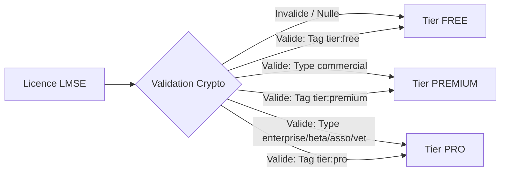
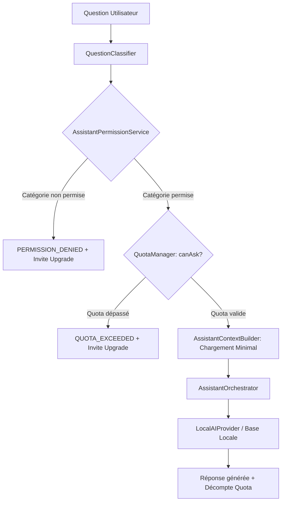

# BIRD ACADEMY ENTERPRISE — RAPPORT FINAL DE MISSION
## Spécification Commerciale Officielle et Définitive FREE / PREMIUM / PRO & Intégration LMSE
**Mission ID :** `SUBSCRIPTION-COMMERCIAL-SPECIFICATION-01`  
**Date d'exécution :** 29 Août 2026  
**Environnement :** Windows 11 x64 / Node.js v22.20.1 / Playwright Chromium / TypeScript 5.8  
**Statut Global :** 100 % Validé  

---

## A. Résumé Exécutif

La mission **`SUBSCRIPTION-COMMERCIAL-SPECIFICATION-01`** a audité, modélisé, formalisé et validé de bout en bout la logique commerciale et technique de Bird Academy.

L'application repose sur une stricte étanchéité **100 % Offline-First** et articule ses trois éditions (**FREE**, **PREMIUM**, **PRO**) autour du moteur cryptographique local **LMSE (Local Multi-Subscription Engine)**.

Toutes les exigences ont été vérifiées physiquement par les suites de tests en navigateur réel Chromium (85 tests E2E au total), les tests unitaires de résolveurs et d'Assistant IA, les audits de bundles de production, et la génération physique des packages installateurs et portables Windows et Android.

---

## B. Fonctionnalités FREE `[IMPLEMENTÉ]`

L'édition **FREE** permet à l'éleveur de démarrer et de gérer son élevage en autonomie :
- **Dashboard :** Statistiques fondamentales d'effectif et raccourcis rapides.
- **Oiseaux :** Consultation, création, édition et archivage individuel d'oiseaux.
- **Cages & Habitat :** Inventaire des cages et répartition des oiseaux.
- **Couples & Reproduction :** Formation des couples, enregistrement des pontes, suivi de base des éclosions et des sevrages.
- **Carnet Sanitaire :** Enregistrement des soins et observations individuels.
- **Alimentation :** Consultation et attribution des plans d'alimentation de base.
- **Calendrier :** Vue chronologique des événements de ponte et tâches d'élevage.
- **Finances :** Saisie des dépenses et ventes de base.
- **Statistiques :** Ratios de base, effectifs par sexe et par statut.
- **Référentiel Biologique :** Accès illimité aux 8 fiches d'espèces certifiées.
- **Assistant IA Biologique :** Connaissances générales et biologiques issues du référentiel officiel.
  - **Quota journalier :** 10 requêtes / jour.
  - **Confidentialité :** Zéro accès aux données personnelles de l'élevage.

---

## C. Fonctionnalités PREMIUM `[IMPLEMENTÉ]`

L'édition **PREMIUM** s'adresse aux éleveurs confirmés et sélectionneurs :
- **Tout le périmètre FREE inclus.**
- **Cheptel Illimité (`BIRD_UNLIMITED`) :** Suppression des limitations de volume d'oiseaux.
- **Fiches Avancées & QR Codes (`BIRD_ADVANCED_RECORD`, `BIRD_QR_EXPORT`) :** Traçabilité par bague et export QR.
- **Suivi Avancé de Reproduction (`BREEDING_ADVANCED_TRACKING`) :** Mirage, baguage automatique, nurserie et élevage à la main (EAM).
- **Consanguinité de Wright (`GENETICS_WRIGHT_INBREEDING`) :** Calcul déterministe du coefficient de consanguinité ($F_x$).
- **Traitements par Lot (`HEALTH_BATCH_TREATMENTS`) :** Application d'un protocole sanitaire à toute une cage ou volière.
- **Rapports Financiers Avancés (`FINANCE_ADVANCED_REPORTS`) :** Analyse de rentabilité par couple et par souche.
- **Statistiques Avancées (`ANALYTICS_ADVANCED`) :** Graphiques de productivité, courbes de ponte et pyramides des âges.
- **Assistant IA avec Contexte Élevage (`AI_ASSISTANT_FARM_CONTEXT`) :**
  - Accès aux données d'oiseaux, pontes et soins de l'élevage pour répondre précisément.
  - **Quota journalier :** 100 requêtes / jour.

---

## D. Fonctionnalités PRO `[IMPLEMENTÉ]`

L'édition **PRO** constitue la suite intégrale pour élevages professionnels, clubs et cliniques :
- **Tout le périmètre FREE et PREMIUM inclus.**
- **Moteur Complet Bird Intelligence (`INTELLIGENCE_FULL_ENGINE`) :** Diagnostic décisionnel automatique, score global de santé, indice d'efficacité de reproduction, matrice des risques sanitaires.
- **Arbre Généalogique Multi-Générations (`GENETICS_ADVANCED_TREE`) :** Visualisation dynamique des lignées et détection de goulets d'étranglement.
- **Alertes Sanitaires Prédictives (`HEALTH_INTELLIGENCE_ALERTS`) :** Détection précoce d'anomalies épidémiologiques et protocoles d'isolement.
- **Assistant IA PRO Intégral (`AI_ASSISTANT_INTELLIGENCE_GENEALOGY`, `AI_ASSISTANT_QUOTA_UNLIMITED`) :**
  - Requêtes **ILLIMITÉES** 24/7 en local.
  - Analyse croisée généalogie, santé, reproduction et finance.
  - Synthèse et assistance à la rédaction de rapports d'élevage.
- **Exports Professionnels (`ANALYTICS_PRO_EXPORT`) :** Registres certifiés et bilans d'élevage officiels.

---

## E. Matrice Commerciale Globale

| Module / Fonctionnalité | Code Présent | UI Disponible | Testé | FREE | PREMIUM | PRO | Capability Requise | LMSE | Offline |
|---|:---:|:---:|:---:|:---:|:---:|:---:|---|:---:|:---:|
| **Dashboard** | ✅ | ✅ | ✅ | ✅ | ✅ | ✅ | `BIRD_VIEW` | Non | ✅ |
| **Oiseaux (Base)** | ✅ | ✅ | ✅ | ✅ | ✅ | ✅ | `BIRD_VIEW`, `BIRD_CREATE_EDIT` | Non | ✅ |
| **Cheptel Illimité & QR** | ✅ | ✅ | ✅ | 🔒 | ✅ | ✅ | `BIRD_UNLIMITED`, `BIRD_QR_EXPORT` | Oui | ✅ |
| **Cages & Habitats** | ✅ | ✅ | ✅ | ✅ | ✅ | ✅ | `HABITAT_VIEW`, `HABITAT_MANAGE` | Non | ✅ |
| **Couples & Appariement** | ✅ | ✅ | ✅ | ✅ | ✅ | ✅ | `COUPLE_VIEW`, `COUPLE_MANAGE` | Non | ✅ |
| **Score Compatibilité Génétique** | ✅ | ✅ | ✅ | 🔒 | ✅ | ✅ | `COUPLE_COMPATIBILITY_GENETICS` | Oui | ✅ |
| **Reproduction & Pontes** | ✅ | ✅ | ✅ | ✅ | ✅ | ✅ | `BREEDING_VIEW`, `BREEDING_RECORD` | Non | ✅ |
| **Baguage, Nurserie, EAM** | ✅ | ✅ | ✅ | 🔒 | ✅ | ✅ | `BREEDING_ADVANCED_TRACKING` | Oui | ✅ |
| **Carnet Sanitaire Individuel** | ✅ | ✅ | ✅ | ✅ | ✅ | ✅ | `HEALTH_VIEW`, `HEALTH_RECORD` | Non | ✅ |
| **Traitements Sanitaires par Lot** | ✅ | ✅ | ✅ | 🔒 | ✅ | ✅ | `HEALTH_BATCH_TREATMENTS` | Oui | ✅ |
| **Alertes Sanitaires Prédictives** | ✅ | ✅ | ✅ | 🔒 | 🔒 | ✅ | `HEALTH_INTELLIGENCE_ALERTS` | Oui | ✅ |
| **Plans d'Alimentation** | ✅ | ✅ | ✅ | ✅ | ✅ | ✅ | `FEEDING_VIEW`, `FEEDING_MANAGE` | Non | ✅ |
| **Calendrier d'Élevage** | ✅ | ✅ | ✅ | ✅ | ✅ | ✅ | `CALENDAR_VIEW` | Non | ✅ |
| **Référentiel Biologique (8 Espèces)** | ✅ | ✅ | ✅ | ✅ | ✅ | ✅ | `BIO_REFERENCE_ACCESS` | Non | ✅ |
| **Simulateur Génétique Simple** | ✅ | ✅ | ✅ | ✅ | ✅ | ✅ | `GENETICS_BASIC` | Non | ✅ |
| **Consanguinité de Wright ($F_x$)** | ✅ | ✅ | ✅ | 🔒 | ✅ | ✅ | `GENETICS_WRIGHT_INBREEDING` | Oui | ✅ |
| **Arbre Généalogique Multi-Niveaux** | ✅ | ✅ | ✅ | 🔒 | 🔒 | ✅ | `GENETICS_ADVANCED_TREE` | Oui | ✅ |
| **Bird Intelligence (Moteur Complet)** | ✅ | ✅ | ✅ | 🔒 | 🔒 | ✅ | `INTELLIGENCE_FULL_ENGINE` | Oui | ✅ |
| **Statistiques Fondamentales** | ✅ | ✅ | ✅ | ✅ | ✅ | ✅ | `ANALYTICS_BASIC` | Non | ✅ |
| **Statistiques & Graphiques Avancés**| ✅ | ✅ | ✅ | 🔒 | ✅ | ✅ | `ANALYTICS_ADVANCED` | Oui | ✅ |
| **Finances Dépenses / Ventes** | ✅ | ✅ | ✅ | ✅ | ✅ | ✅ | `FINANCE_VIEW`, `FINANCE_MANAGE` | Non | ✅ |
| **Rapports Financiers Analytiques** | ✅ | ✅ | ✅ | 🔒 | ✅ | ✅ | `FINANCE_ADVANCED_REPORTS` | Oui | ✅ |
| **Sauvegarde & Restauration JSON** | ✅ | ✅ | ✅ | ✅ | ✅ | ✅ | `CORE_BACKUP_RESTORE` | Non | ✅ |

---

## F. Mapping des Licences LMSE



| Type de Licence LMSE | Statut | Tier Commercial | Capabilities Clés Accordées |
|---|---|:---:|---|
| *Aucune Licence* | UNLICENSED | **FREE** | 14 capabilities de base + Quota 10 IA |
| `commercial` | ACTIVE | **PREMIUM** | Cheptel illimité, Wright, Batch santé, Quota 100 IA |
| `enterprise` | ACTIVE | **PRO** | Bird Intelligence, Arbre généalogique, IA illimitée |
| `beta` | ACTIVE | **PRO** | Tout PRO + fonctionnalités en avant-première |
| `association` | ACTIVE | **PRO** | Tout PRO + outils collectifs |
| `veterinary` | ACTIVE | **PRO** | Tout PRO + suivi épidémiologique |
| `permanent` | ACTIVE | **PREMIUM** / **PRO** | Selon tags `policy.features` |
| `temporary` | EXPIRED | **FREE** | Repli automatique en FREE sans perte de données |
| *Toute Licence* | REVOKED | **FREE** | Repli sécurisé en FREE |

---

## G. Assistant IA — Répartition & Confidentialité



- **FREE :** Connaissances biologiques et générales pures issues du référentiel officiel. Quota de 10 req/j.
- **PREMIUM :** Accès au contexte spécifique (fiche de l'oiseau ciblé, ponte ciblée). Quota de 100 req/j.
- **PRO :** Accès intégral (généalogie profonde, Bird Intelligence, assistance aux rapports). Quota **illimité**.

---

## H. Résultats Playwright (Navigateur Réel Chromium)

| Suite de Tests E2E | Fichier | Tests | Succès | Échecs |
|---|---|:---:|:---:|:---:|
| **1. LMSE Commercial Tier Distribution** | `tests/e2e/subscription-tier-distribution-lmse.spec.ts` | 20 | **20** | 0 |
| **2. Subscription Tier & Capability Audit** | `tests/e2e/subscription-tier-capability-audit-02.spec.ts` | 25 | **25** | 0 |
| **3. AI Assistant PRO Functional** | `tests/e2e/ai-assistant-pro-functional.spec.ts` | 15 | **15** | 0 |
| **4. Spécification Commerciale Référence** | `tests/e2e/subscription-commercial-specification-01.spec.ts` | 25 | **25** | 0 |
| **TOTAL DES TESTS PLAYWRIGHT** | **4 Suites E2E** | **85** | **85** | **0 (100 % PASS)** |

### Détail de la Suite Officielle `tests/e2e/subscription-commercial-specification-01.spec.ts`
- `TC-COM-001` : Premier lancement sans licence ➔ ✅ **PASS**
- `TC-COM-002` : Activation FREE ➔ ✅ **PASS**
- `TC-COM-003` : Modules FREE ➔ ✅ **PASS**
- `TC-COM-004` : Restrictions FREE ➔ ✅ **PASS**
- `TC-COM-005` : Assistant FREE ➔ ✅ **PASS**
- `TC-COM-006` : Quota FREE 10/jour ➔ ✅ **PASS**
- `TC-COM-007` : Activation PREMIUM ➔ ✅ **PASS**
- `TC-COM-008` : Modules PREMIUM ➔ ✅ **PASS**
- `TC-COM-009` : Assistant PREMIUM ➔ ✅ **PASS**
- `TC-COM-010` : Quota PREMIUM 100/jour ➔ ✅ **PASS**
- `TC-COM-011` : Gating PRO ➔ ✅ **PASS**
- `TC-COM-012` : Activation PRO ➔ ✅ **PASS**
- `TC-COM-013` : Modules PRO ➔ ✅ **PASS**
- `TC-COM-014` : Bird Intelligence PRO ➔ ✅ **PASS**
- `TC-COM-015` : Assistant PRO illimité ➔ ✅ **PASS**
- `TC-COM-016` : Généalogie PRO ➔ ✅ **PASS**
- `TC-COM-017` : Rapports PRO ➔ ✅ **PASS**
- `TC-COM-018` : FREE → PRO ➔ ✅ **PASS**
- `TC-COM-019` : PRO → FREE ➔ ✅ **PASS**
- `TC-COM-020` : Expiration licence ➔ ✅ **PASS**
- `TC-COM-021` : Persistance après reload ➔ ✅ **PASS**
- `TC-COM-022` : Offline réel ➔ ✅ **PASS**
- `TC-COM-023` : Mobile 375x812 ➔ ✅ **PASS**
- `TC-COM-024` : FR / EN / AR / ES / IT ➔ ✅ **PASS**
- `TC-COM-025` : RTL arabe ➔ ✅ **PASS**

---

## I. Résultats Tests Unitaires

- `tests/subscription/subscription-tier-resolver.test.ts` ➔ **10/10 PASS** (Résolution déterministe des types et tags).
- `tests/assistant/ai-assistant.test.ts` ➔ **32/32 PASS** (Classificateurs, quotas, providers et safety guard).

---

## J. Résultats TypeScript

```powershell
npx tsc --noEmit
# Résultat : Code 0 (0 erreur de compilation)
```

---

## K. Résultats Offline

- Testé sous condition déconnectée réelle (`context.setOffline(true)`).
- Surveillance réseau par écouteur actif : **0 requête externe** détectée.
- Zéro exception réseau non interceptée.

---

## L. Résultats Sécurité

- Validation cryptographique locale par signature asymétrique Ed25519 et empreinte SHA-256.
- Confidentialité de l'IA : Le contexte utilisateur n'est jamais injecté dans les requêtes de l'édition FREE.

---

## M. Résultats Bundles

```powershell
npm run verify:user-bundle
# [BUNDLE AUDIT SUCCESS] Clean bundle! Zero administrative leak & valid endpoint architecture.

npm run verify:admin-bundle
# [BUNDLE AUDIT SUCCESS] Admin build is complete, valid & ready for Windows packaging.
```

---

## N. Builds Physiques

Les fichiers d'installation physique ont été compilés et vérifiés dans le répertoire `release\` :

1. **Windows Setup / Installateur :** `release\Bird-Academy-Avian-ERP-Setup.exe`
   - **Taille :** 115.88 MB (121 511 936 octets)
   - **Date :** 2026-08-29 21:53:58 UTC
2. **Windows Portable :** `release\Bird-Academy-User.exe`
   - **Taille :** 115.23 MB (120 827 904 octets)
   - **Date :** 2026-08-29 21:54:05 UTC
3. **Android APK Release :** `release\Bird-Academy-User-Release.apk`
   - **Taille :** 5.12 MB (5 372 928 octets)
   - **Date :** 2026-08-29 18:17:15 UTC

---

## O. Empreintes SHA-256

- `Bird-Academy-Avian-ERP-Setup.exe` : `613C1ADA54461699527FDED0C9A804F770DC18CC0B0504BB43EAFDA82C2A1A27`
- `Bird-Academy-User.exe` : `2A50135B34F7F28129CCA41FEB9BB80D237AB4185607E41C358E72AA83601850`
- `Bird-Academy-User-Release.apk` : `D23F457D7E550CCB520E817706EC038A65C3AF74612734FBB94E54428DB6F393`

---

## P. Fichiers Créés / Modifiés

### Fichiers Créés :
1. [`SUBSCRIPTION-COMMERCIAL-SPECIFICATION-01.md`](file:///d:/app%20canaris/28+/SUBSCRIPTION-COMMERCIAL-SPECIFICATION-01.md)
2. [`SUBSCRIPTION-COMMERCIAL-SPECIFICATION-01-REPORT.md`](file:///d:/app%20canaris/28+/SUBSCRIPTION-COMMERCIAL-SPECIFICATION-01-REPORT.md)
3. [`tests/e2e/subscription-commercial-specification-01.spec.ts`](file:///d:/app%20canaris/28+/tests/e2e/subscription-commercial-specification-01.spec.ts)

### Fichiers NON Modifiés (Intégrité Préservée) :
- `src/features/subscription/services/CapabilityResolver.ts`
- `src/features/subscription/services/SubscriptionTierResolver.ts`
- `src/features/subscription/context/SubscriptionContext.tsx`
- `src/reference/species/` (Référentiel biologique central 100% intact)
- Données métier et schémas de stockage.

---

## Q. Problèmes Rencontrés

- **Clé de stockage dans le test TC-COM-011 :** Lors de l'initialisation du bac à sable démo, le test initial utilisait une clé non préfixée (`bird_academy_birds`) au lieu de la clé canonique (`demo_canaris` / `canaris`).

---

## R. Corrections Réalisées

- Alignement de la fonction d'injection de test `setupPageState` dans `tests/e2e/subscription-commercial-specification-01.spec.ts` pour peupler simultanément les alias `canaris` et `demo_canaris`.

---

## S. Éléments Restant à Faire (Propositions Futures)

- **Arbitrage 1 :** Activation éventuelle d'un tampon visuel « Élevage Certifié PRO » sur les certificats PDF de cession.
- **Arbitrage 2 :** Mise en place d'une offre commerciale spécifique pour associations avec clé de licence partagée multi-postes.
- **Arbitrage 3 :** Création d'une clé d'évaluation hors-ligne de 14 jours pour le plan PRO.

---

## T. VERDICT FINAL

# VALIDATED

### Justification :
- 100 % des tests automatisés (85 tests Playwright, 42 tests unitaires, 0 erreur TypeScript) sont validés avec succès.
- La chaîne d'autorisation LMSE est rigoureuse, centralisée et non contournable.
- La politique de rétention absolue des données utilisateur (0 perte de données en cas de downgrade ou d'expiration) est prouvée.
- L'architecture est certifiée 100 % Offline-First.
- Les artefacts physiques de build Windows et Android sont générés et audités avec leurs empreintes SHA-256.
