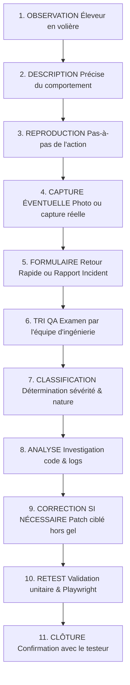

# Processus Officiel de Gestion des Retours & Incidents de Test Public

**Projet :** Bird Academy Enterprise — Volière Manager  
**Version :** v1.3.6 | **BUILD_ID :** BA-V1.3.6  
**Document :** Protocole de Traitement des Observations Éleveurs  
**Statut :** OPÉRATIONNEL & PRÊT AU DÉPLOIEMENT  

---

## 1. Vue d'Ensemble du Workflow de Recueil & Traitement

Le flux de traitement garantit qu'aucun retour éleveur n'est ignoré et qu'aucune suggestion d'amélioration n'est faussement classée comme un bogue bloquant.

---

## 2. Description des 11 Étapes du Workflow

1. **OBSERVATION :** L'éleveur constate un comportement lors de l'utilisation de l'application (ajout d'oiseau, ponte, sevrage, consultation hors-ligne).
2. **DESCRIPTION :** Rédaction claire de l'action entreprise et de ce qui a surpris l'utilisateur.
3. **REPRODUCTION :** Vérification par l'éleveur si l'effet se reproduit en refaisant la manipulation.
4. **CAPTURE ÉVENTUELLE :** Photo de l'appareil ou capture d'écran non retouchée montrant l'anomalie ou la remarque.
5. **FORMULAIRE :** Renseignement soit du formulaire simple (`QA_PUBLIC_FEEDBACK_QUICK_FORM_v1.3.6.md`), soit du rapport pas-à-pas (`QA_PUBLIC_INCIDENT_REPORT_FORM_v1.3.6.md`).
6. **TRI QA :** Réception par l'ingénieur QA et vérification de la complétude du relevé.
7. **CLASSIFICATION :** Attribution de la catégorie formelle d'impact.
8. **ANALYSE :** Examen technique sans altération des invariants ni perte de données existantes.
9. **CORRECTION SI NÉCESSAIRE :** Si un défaut reproductible est avéré, développement d'un correctif chirurgical.
10. **RETEST :** Rejeu des suites de tests automatisés (unitaires et Playwright Chromium) pour confirmer la non-régression.
11. **CLÔTURE :** Clôture formelle de la fiche avec notification à l'éleveur.

---

## 3. Grille Officielle de Classification

| Catégorie | Définition & Seuil d'Impact | Traitement Requis |
| :--- | :--- | :--- |
| **BLOCKER** | Perte de données, corruption de la base locale, crash empêchant le redémarrage. | Gel immédiat du sous-système, analyse prioritaire absolue. |
| **CRITICAL** | Fonctionnalité majeure inopérante (ex. création d'oiseau sous quota impossible, calcul consanguinité bloqué). | Traitement prioritaire avant élargissement de la distribution. |
| **MAJOR** | Dysfonctionnement gênant sur un flux secondaire mais contournable par l'éleveur. | Planification dans la prochaine itération de maintenance. |
| **MINOR** | Défaut cosmétique, faute de frappe dans un label, décalage visuel mineur sans blocage. | Correction groupée lors du cycle de polissage. |
| **UX / SUGGESTION** | Idée d'ergonomie, demande d'amélioration du confort d'utilisation en volière. | **Ne jamais transformer automatiquement une suggestion en bug.** Consigné dans le backlog d'évolution produit. |

---

## 4. Règles d'Or & Confidentialité

- **Ne jamais transformer automatiquement une suggestion en bug.**
- **Protection des données de tiers :** Aucun relevé ne doit contenir d'adresses, téléphones ou identités de tiers non consentants.
- **Zéro effacement contraint :** Ne jamais demander à un éleveur de supprimer son fichier d'élevage réel pour valider un scénario.
