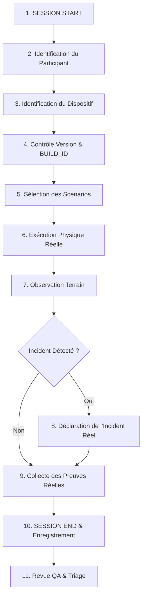

# Protocole d'Exécution d'une Session Réelle de Test — Bird Academy Enterprise
**Version Cible :** `v1.3.6`  
**BUILD_ID :** `BA-V1.3.6`  
**Application :** Bird Academy Enterprise — Volière Manager  

---

## 1. Vue d'Ensemble du Protocole

Ce protocole régit le déroulement strict d'une session de test terrain exécutée par un testeur réel. Aucune session ne doit être déclarée sans avoir traversé l'intégralité des étapes ci-dessous.

---

## 2. Déroulé Étape par Étape

### Étape 1 : Session Start
- Le testeur installe ou lance l'application sur son terminal de test.
- La date et l'heure de début sont relevées (format ISO8601).
- Un identifiant de session unique est attribué : `SES-XXX` (ex: `SES-001`).

### Étape 2 : Identification du Participant
- Le testeur est identifié via son identifiant de registre : `USR-XXX` (ex: `USR-001`).
- Son niveau d'expérience (amateur, passionné, professionnel) et sa langue préférée sont confirmés.
- Le statut de consentement est validé (`consentStatus = true`).

### Étape 3 : Identification du Dispositif
- L'appareil réellement utilisé est associé : `DEV-XXX` (ex: `DEV-001`).
- Type de terminal : Ordinateur portable, PC de bureau, Tablette ou Smartphone.
- Système d'exploitation et version (ex: Windows 11 23H2 x64, Android 14).
- Mode de connectivité au démarrage : Hors-ligne (recommandé pour tester l'autonomie) ou En ligne.

### Étape 4 : Contrôle Version & BUILD_ID
- **Version applicative affichée :** Doit être strictement `v1.3.6`.
- **BUILD_ID affiché :** Doit être strictement `BA-V1.3.6`.
- Si l'un de ces éléments ne correspond pas, la session est suspendue immédiatement.

### Étape 5 : Sélection des Scénarios
- Le testeur sélectionne un ou plusieurs scénarios parmi les 25 scénarios formalisés (**H-W01 à H-W25**).
- Exemples :
  - `H-W01` : Installation propre.
  - `H-W03` : Saisie des 20 premiers oiseaux.
  - `H-W04` : Tentative de création du 21e oiseau (vérification du blocage quota).
  - `H-W15` : Navigation complète en mode 100% hors-ligne.
  - `H-W20` : Vérification du mode Arabe RTL.

### Étape 6 : Exécution Physique Réelle
- Le testeur manipule lui-même l'application dans son environnement habituel.
- Aucune assistance automatisée ou script de simulation n'est autorisé.

### Étape 7 : Observation Terrain
- Le testeur observe le comportement : réactivité, fluidité, affichage des libellés, confirmation des boutons.
- Il consigne ce qu'il voit de manière neutre et factuelle.

### Étape 8 : Preuves Réelles Éventuelles
- Si une observation notable ou une validation est effectuée :
  - Capture d'écran native de l'OS.
  - Photo claire de l'écran du terminal.
  - Export de sauvegarde au format JSON généré par l'application.
- Les preuves sont archivées dans le registre des preuves avec leur hachage SHA-256 (`QA_TEST_EVIDENCE_REGISTRY.json`).

### Étape 9 : Signalement d'Incident Éventuel
- Si un bug, un blocage, ou une erreur de calcul est constaté :
  - Attribution d'un `incidentId` : `INC-XXX` (ex: `INC-001`).
  - Classification de la sévérité : `BLOCKER`, `CRITICAL`, `MAJOR`, ou `MINOR`.
  - Description exacte des étapes de reproduction.
  - Comportement attendu vs comportement observé.

### Étape 10 : Session End & Enregistrement
- Relevé de l'heure de fin.
- Statut de la session : `COMPLETED`, `BLOCKED`, ou `ABANDONED`.
- Enregistrement formel de la ligne dans [QA_TEST_SESSION_LOG_REGISTRY.json](file:///d:/app%20canaris/28+/QA_TEST_SESSION_LOG_REGISTRY.json).
- Mise à jour du compteur `sessionsExecuted`.

### Étape 11 : Revue QA & Triage
- L'équipe QA passe en revue la session enregistrée.
- Si des incidents ont été déclarés, ils sont triés selon la politique d'escalade.
- Les scénarios exécutés sont mis à jour (`NOT_EXECUTED` → `PASS` ou `FAIL`).

---

## 3. Règle d'Or de l'Audit

> **Aucune session ne peut être créée à titre préventif ou simulée.**  
> Le registre `QA_TEST_SESSION_LOG_REGISTRY.json` ne doit comporter que des sessions ayant effectivement été vécues et documentées par des personnes réelles.
